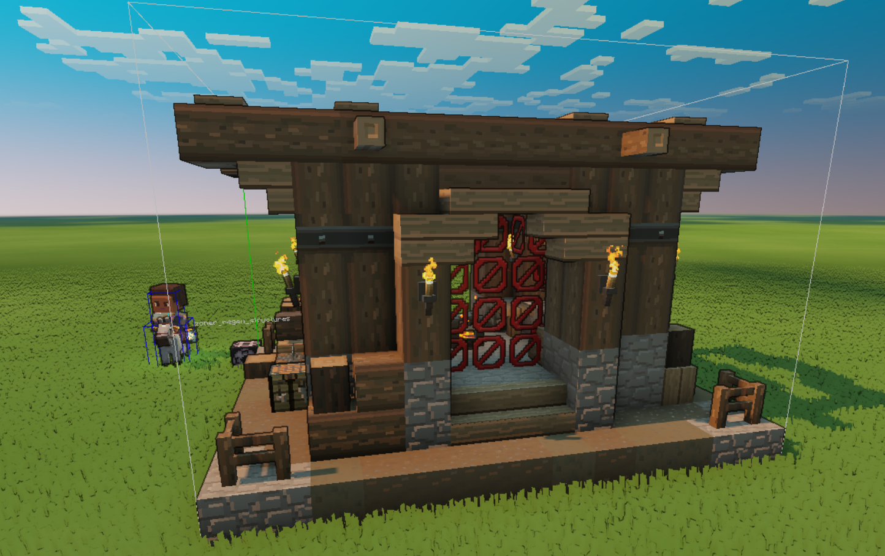
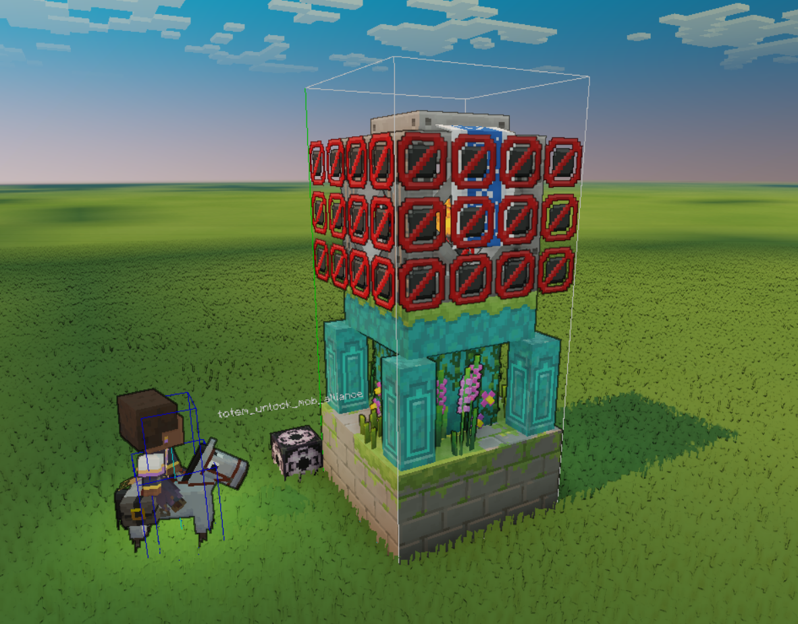
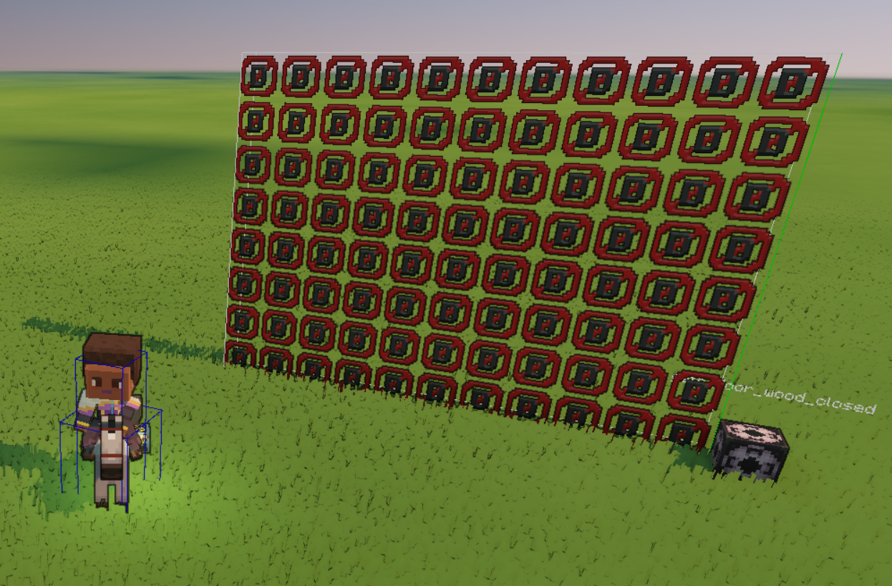
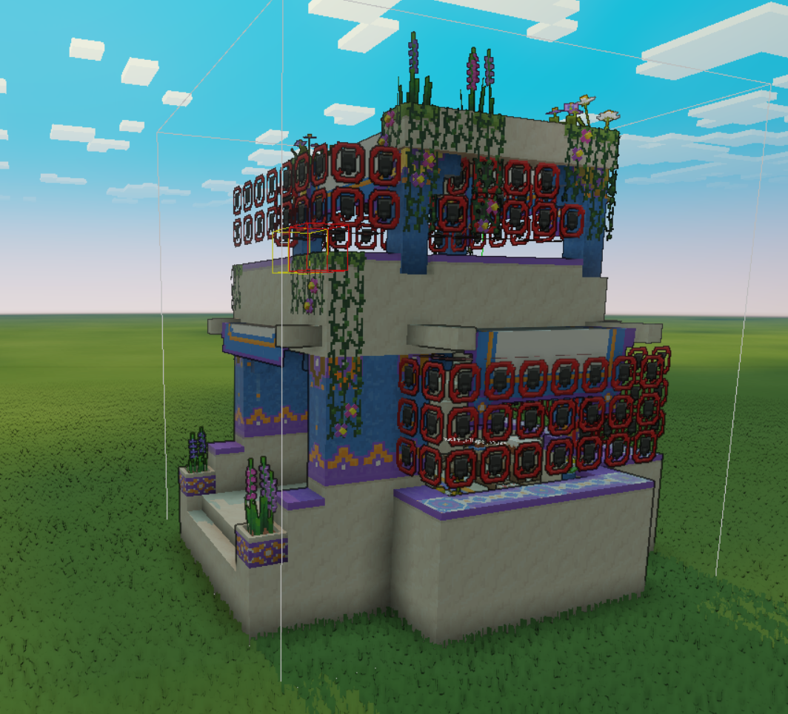

# Barrier Blocks in Minecraft Legends
In most cases barrier blocks are invisible blocks used to block player and mob collision. We have a few barrier blocks that are very specific and used in a handful of specialized cases.

## Blocks
Each barrier block used in game are listed below with examples of how and where to use them:

### block_barrier_soft

Player and Mob collision, no damage receiver.

Can be used for blocking the player and mobs from entering the structure.

### block_barrier_solid

Player and Mob collision, has damage receiver.

Can be used for blocking the player and mobs from passing through the deco block, but also if hit with the player sword it would plink off the block.

### block_barrier_path
Player and Mob collision, no damage receiver, ignored by pathfinding.

Not currently used for anything.

### block_barrier_door
Player and Mob collision, has damage receiver, ignored by pathfinding.

Gate closed and Piglin Gate closed structure entites both use this block to prevent entities entering through the gate.

### block_barrier_boss
Player is able to walk through. Stops boss mobs from entering lava in boss fights. (Only used in base gen boss areas)

Used in the defend horde boss battle. The block is generated above all lava areas so the boss cannot fall in.

### block_village_solid_air
Player is able to pass through. Stops mobs from leaving village houses through windows. (Only used in village houses)
      
Used in the medium village house. The blocks are placed in the areas we don't want the mobs traveling. Forcing them to use the door but still allowing the player to pass through. 

### block_barrier_soft_denether
Player and Mob collision, no damage receiver. Block is denetherable and gatherable. (Only used in denetherable/gatherable structures)

Used in the obstacle horde mushroom trees. This act the same as the `block_barrier_soft` but when the tree is denethered the barrier blocks will also disappear.

