# Blockbench To Minecraft Legends
This article will walk you through how to add custom models and textures to Minecraft Legends using the popular free software Blockbench. Adding custom art content is essential to make your experience stand out and look different from the base game. For more information on using blockbench please visit the following link:

https://www.blockbench.net/quickstart

and then go to Minecraft: Bedrock Edition > Entity/model for some quick start information and a few tutorials. 

```
Important! 
Be sure to only use the Bedrock Entity Project type when creating projects as the exporter only supports cube geometry.
```

In this Article you will learn the following:

* How to install Blockbench

* How to install the plugin

* How to export models, animations and textures


# Minecraft Legends Exporter Overview

Minecraft Legends Exporter is a plugin for Blockbench to help with exporting models into a format that Minecraft Legends can use. This Article will cover how to install the plugin and how to export models, textures, animations as well as tips & best practices.

# Download Blockbench

To use this plugin, you need [Blockbench](https://www.blockbench.net/downloads)

# Installing the plugin

1.  Download the [Minecraft: Legends plugin](https://github.com/Mojang/legends-blockbench-plugin/releases)
2.  Unzip the downloaded release.
3.	Open Blockbench and using the menu bar select **File** > **Plugins**

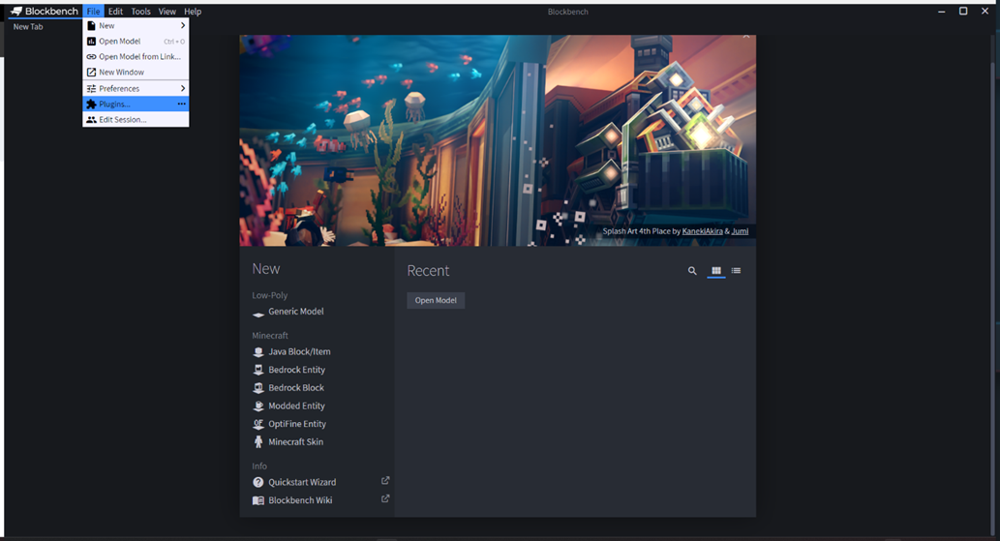

4.	Select the load plugin icon (the icon between “Plugins” and the cloud icon). This will open a file dialog. From the file dialog, navigate to where you unzipped the downloaded plugin, select the `legends-blockbench-plugin
/minecraftLegendsExporter.js` file, and then select Open. 

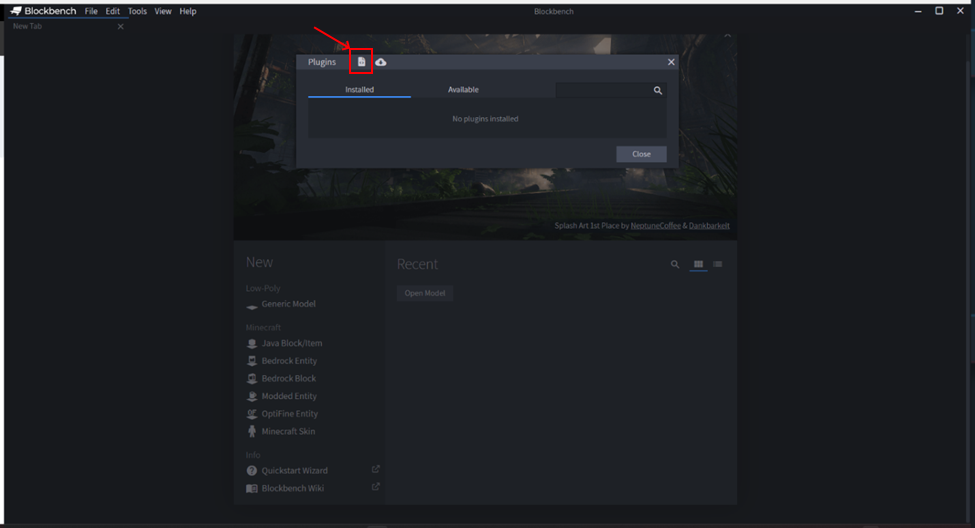
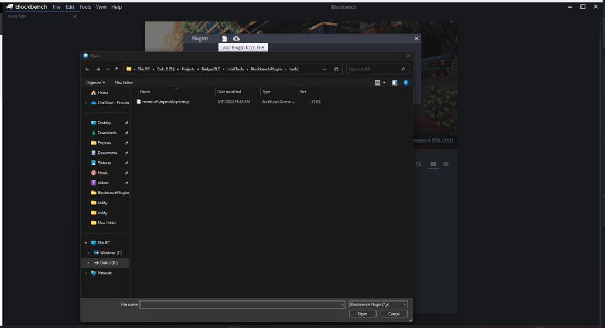

5.	There will be a popup that displays the following prompt: ”Do you want to allow this plugin to make changes to your PC? Only load plugins from authors you trust.”  Select Ok and the plugin will be loaded.

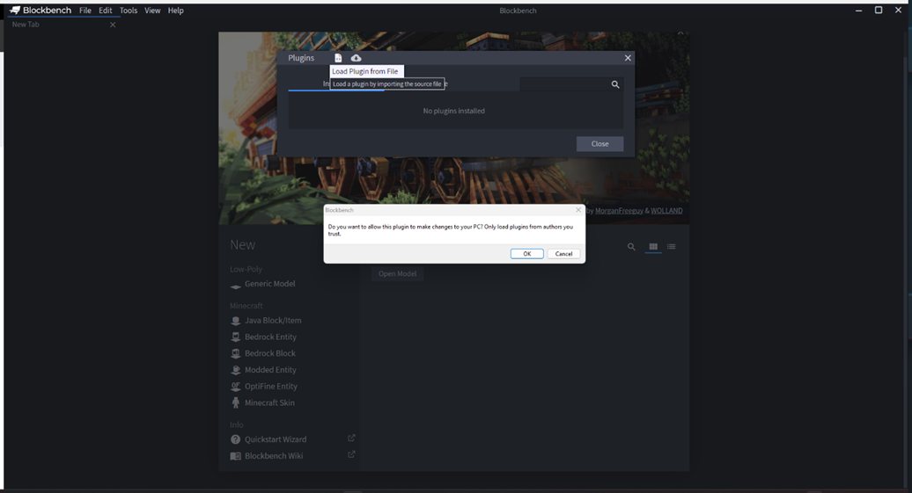

The exporter plugin is now loaded and ready to go. In the next section we’ll take a look at exporting a model. For more information on how to use Blockbench and create a model file please refer to the top of the article for a link to some tutorial information. For some guidelines regarding creating models specifically for Minecraft Legends please go to the best practices section. 

```
Important! 
Again, be sure to only use the Bedrock Entity Project type when creating projects as the exporter only supports cube geometry.
```

# Exporting a model

When you have created your model and are ready to export, navigate to **File** > **Export** > **Minecraft Legends Exporter**

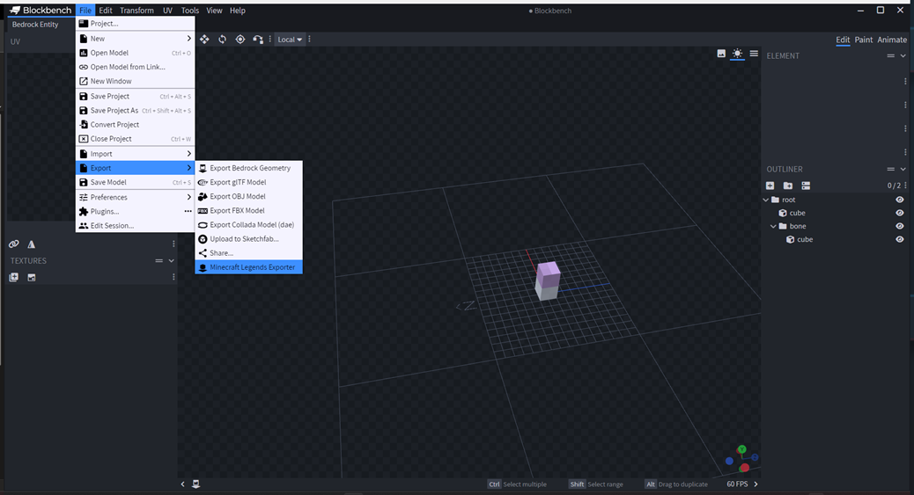

It will open a dialog box called **Export Options**:

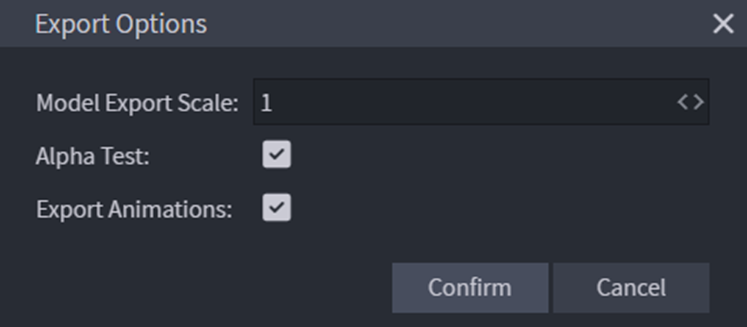

You have three controls within the Export Options dialog:
* **Model export Scale**: This is the scale to which the model will be exported.  By default, the scale is set to 1 and the model will be exported to the normal Minecraft legends scale.
* **Alpha Test**: This check box determines if the material will interpret the alpha channel of the texture as transparency. If not checked, all texels will be opaque.
* **Export Animations**: If this is checked when you press confirm it will open a secondary dialog where you can select which animations to export.

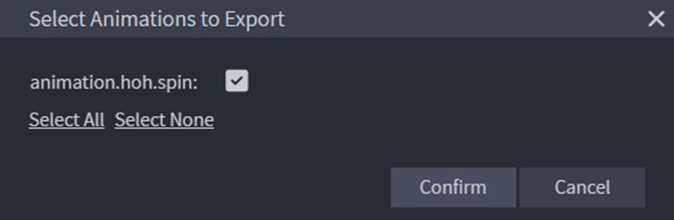

When you have set your Export Options it will open a folder selection menu where you can select where the files will be exported. You have now successfully exported the following files:

* model

* texture

* material

* animations (if export animations were selected)

To be able to spawn the model in the game you need to create an entire Minecraft legends entity. The following files are required for a Minecraft legends entity:
**Behavior pack files**:
* Entity.json
**Resource Pack Files**:
* Entity.json
* Animation_controllers.json
* Render_controllers.json
Creation of the behavior and resource pack files, however, is outside of the scope of this article.

# Best Practices

Here are a couple of suggestions when creating the model to avoid any unforeseen errors:
 
**Project type**: Only Use the Bedrock Entity Project type in Blockbench as the exporter only supports the block shape.

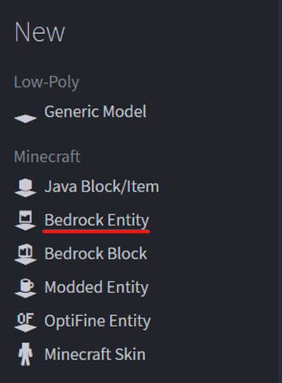
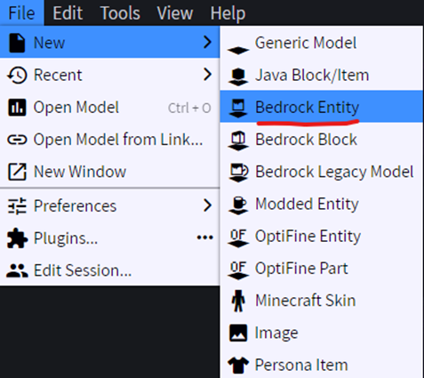

**Naming conventions**:
Make sure to only use 

* letters 
* numbers
* ```.``` (period)
* ```-``` (dash)
* ```_``` (underline) 

When creating identifiers and names for files, textures and animations. Otherwise, issues could arise when exporting models or when trying to import them into your project.

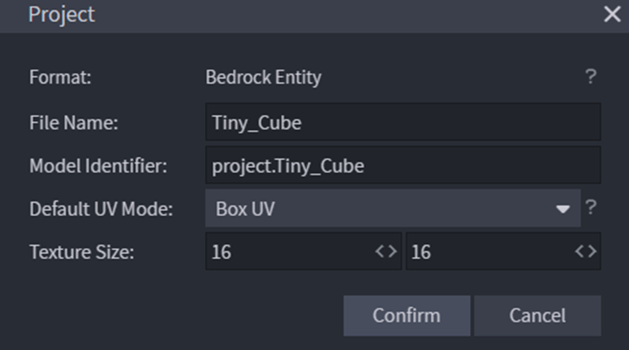

**Root Bone**:
It is recommended that every model starts with a root bone that is the parent of everything and that the bone’s Pivot Point and Rotation is left at 0, 0 ,0. Then create the model and animations inside of this root bone

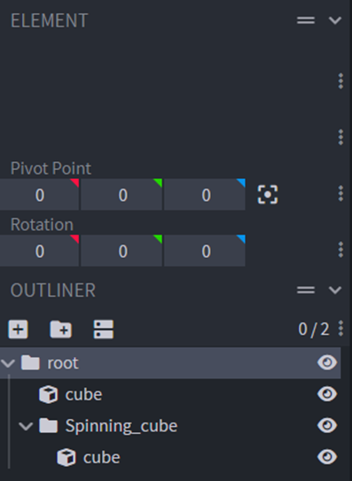

**Single Texture**:
Try to use a single texture for the entire model, so that your material gets exported. If you want to use multiple textures, you will need to edit the material file to contain multiple textures.
