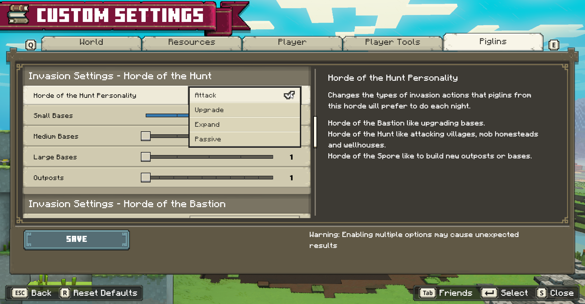
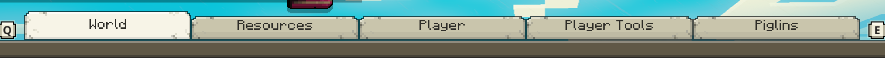
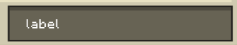
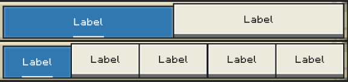
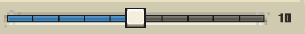

# Minecraft Legends - Custom Game Settings



**Figure 1:** Screenshot of custom settings screen

## What are custom game settings?

Campaign and PVP have separate 'custom' game modes that feature a wide variety of settings to adjust various gameplay systems. These can range from player unit and enemy behaviors, starting and max resources, available structures, etc.

The data for custom settings lives in `resource_packs/badger_base/gamelayer/launcher/custom_game_settings.json`

## How to add a custom game setting?

Adding a custom game setting is done through a combination of adding Custom Settings Data as well as data that reads the value of the setting to apply its effects in game. Both of these aspects are explained in greater detail [below](https://github.com/Mojang/minecraft-legends-docs/blob/main/CustomGameSettings.md#using-custom-settings).

The vast majority of custom game settings that already exist are configured this way and can serve as examples for additional options. Note however that options such as 'world_world_seed' and 'world_world_size' have specific functionality in the game's engine which is not accessible.

### Custom Settings Data

The settings data is laid out with a category name for the main object, which will contain several sub categories and each sub category will have a list of settings.

The main categories are the names of the Tabs in the custom settings screen and the sub categories are the names of the headers above each section of settings per tab.

```
{
    "mainCategory": {
        "subCategory": [
			{ //  ========  Example ========
				"id": "world_world_seed",
				"value_type": "string",
				"value": "",
				"backend_type": "customgame",
				"ui_type": "textfield",
				"game_mode_type": "allmodes",
				"is_editable": false,
				"save_last_used_value": false,
				"enable_requirements": [],
				"options": [
				]
			},
		]
    }
}
```

#### Property: Category ("mainCategory" from example) & Sub Category ("subCategory" from example)

**required**

Add the setting to an existing category/subcategory. May choose to create a new category or subcategory, this will create a new tab or sub header respectively.



#### Property: "id"

**required**

This will be the identifier for the setting, and how it will be referenced when connecting the value to the gameplay system.

#### Property: "backend_type"

**required**

_possible values_: "customgame" (always)

#### Property: "value_type"

**required**

_possible values_: "int", "float" or "string"

#### Property: "ui_type"

**required**

_possible values_:

| Type        | Visual                                          | "uiType"                | "valueType"    | "options"                         |
| ----------- | ----------------------------------------------- | ----------------------- | -------------- | --------------------------------- |
| Switch      |      | "switch"                | "int"          |                                   |
| Slider      |      | "slider"                | "int", "float" | [{"min": #}, {"max": #}]          |
| Button      |      | "button" or "rowbutton" | n/a            |                                   |
| Dropdown    |    | "dropdown"              | "int"          | {"label": string}                 |
| Textfield   |   | "textfield"             | "string"       |                                   |
| Radio Group |  | "radiogroup"            | "string"       | [{"label": option name}, {} ....] |
| Toggles     |     | "toggles"               | "int"          |                                   |

#### Property: "is_editable"

**optional**

Dictates if the setting can be edited when loading a saved custom game.
_possible values_: true or false

#### Property: "save_last_used_value"

**optional**

_possible values_: true or false
Defaults to _true_

#### Property: "enable_requirements"

**optional**

What conditions are required for the setting to be enabled (meaning visible)

_possible values_:

| Requirement             | Description                |
| ----------------------- | -------------------------- |
| "platform_ps"           | If Playstation platform    |
| "platform_not_gamecore" | If not PC or Xbox platform |
| "platform_pc"           | If PC platform             |
| "platform_nx"           | If Switch platform         |
| "platform_not_ps"       | If not PS platform         |
| "platform_not_nx"       | If not Switch platform     |
| "platform_not_steam"    | If not Steam platform      |

#### Property: "game_mode_type"

**optional**

Dictates which game mode the setting will appear in

_possible values_: "allmodes", "campaign" or "pvp"

#### Property: slider_convert_to_percent

**optional**

For slider settings only. Setting this to _true_ will convert the value to a percent visually in the menu. It will not affect the actual value used by the gameplay system.

_possible values_: true or false
Defaults to _false_

#### Property: "slider_step_incremenet"

**optional**

For slider settings only. Numeric value to be used as the slider value increment. (Sliders default to 1)

_possible values_: any whole number (preferably a number that will divide the full range of the slider evenly)



### Using Custom Settings

After the data for a custom game setting has been added, it should appear in the front end when starting a new custom game, or loading a previously saved one in the case of custom campaigns. When the game is started (from the lobby) each setting and their values will be stored on the server and saved alongside other game data.

The values for each custom game setting can then be used with entity archetype data and/or in B# scripts that exist on the server.

#### Entity Archetypes

Entities are constructed with a series of components that describe their behaviour. Since custom game settings are server-bound, this section only applies to server entity descriptions. For more general information about how entities are constructed, as well as a list of all the available components and their properties, check out the documentation for [Entities](https://github.com/Mojang/minecraft-legends-docs/blob/main/Entities.md#server-entity-documentation).

In particular, there is a family of components with similar names: _badger:difficulty*modifier*..._

These components are the mechanism in which an entity's properties can be altered based on what difficulty is chosen by the player. Consider this example:

```
      "badger:difficulty_modifier_damage": {
        "difficulties": {
          "Peaceful": {
            "post_multiply": 0.5
          },
          "Easy": {
            "post_multiply": 1.0
          },
          "Normal": {
            "post_multiply": 1.5
          },
          "Hard": {
            "post_multiply": 2.0
          }
        }
      }
```

Since `badger:difficulty_modifier_damage` changes the damage of an entity's target actions, attaching this component to an entity would mean that the damage they deal through their target actions would increase as players choose harder difficulties. _See [the documentation](https://github.com/Mojang/minecraft-legends-docs/blob/main/Entities.md#badgerdifficulty_modifier_damage) for these components for a complete description of these properties._

Custom game modes have their own 'Custom' difficulty as they don't rely on traditional difficulty options for modifications such as this, however the same machanism is used to modify entities. Rather than defining a static value for a traditional difficulty, a separate section `"custom_game_settings"` can be used instead or in tandem:

```
      "badger:difficulty_modifier_damage": {
        "difficulties": { ... },
        "custom_game_settings": [
          {
            "setting_name": "unit_damage",
            "numeric_modifier_type": "post_multiply",
			"scaling_factor": 1.0
          }
        ]
      }
```

Comparing this to the previous example, if an entity in a custom game had this component in it's description, their target actions' damage would instead be modified by _multiplying_ their base damage (which is the damage in the specific target action) by the value set for the `unit_damage` custom game setting.

A description of each property is as follows:

| Property              | Values                                         | Description                                                                                        |
| --------------------- | ---------------------------------------------- | -------------------------------------------------------------------------------------------------- |
| setting_name          | any valid custom setting id                    | The id of the custom game setting whose value you want to use for modifying the entity's property. |
| numeric_modifier_type | pre_add, post_add, pre_multiply, post_multiply | Descriptor for how the value of the custom game setting should be applied to the base value.       |
| scaling_factor        | any float between (0.0, 1.0]                   | Scales the value of the custom game setting before it is applied to the entity's base value.       |

This applies to all the components in the _badger:difficulty*modifier*..._ family. Check out the [Entities](https://github.com/Mojang/minecraft-legends-docs/blob/main/Entities.md#server-entity-documentation) documentation to see all of these components that are available.

A special mention here for the `"badger:template"` component as well. This component can be used for specific entity descriptions to inherit the components from the descriptions of other entities. This can be really useful for custom game settings since we can define a single difficulty modifier elsewhere and apply it to any number of different entities. Just define the difficulty modifier on a generic entity and then include its identifier in the template component for your specific entity and it will be modified the same as if you added it directly. **Note that if an entity inherits from another and they both define the same component, the resulting component will have a combination of both copmonents' properties, using the property of the inheriting entity's components when they're defined for both.**

#### B# Scripts

_This section only covers specifically how custom game settings are used within B# scripts. For a better idea how B# is used generally, check out the [B# Reference Sheet](https://github.com/Mojang/minecraft-legends-docs/blob/main/BSharpReferenceSheet.md#b-reference-sheet)_

When the game is started from the lobby and the values of each setting have been receieved, each value is provided to scripts through a special bootstrap snippet **SNIPPET_GameSettingInitialized** wherever the custom game setting's id matches the first argument of the snippet.

```
SNIPPET_GameSettingInitialized("custom_game_setting_id", (value) => {
    const settingValue = value.value

    // Do stuff with the setting's value
})
```

These snippets trigger before any other bootstrap snippets so that their effects can be applied before they are used anywhere else. This can be helpful in cases where things like data structures need to be altered based on the provided value(s).

These snippets also trigger every time a game mode is launched, either from a new game or one that was previously saved. This is because B# script files are always parsed at this time, so previous changes in scripts that are not saved need to be re-applied each time a saved game is loaded to keep the behaviour consistent.
