# Minecraft Legends Geology Service

## What is the Geology Service?
The Geology Service is a system that lets us place special “geology” textures in the world. It allows us to generate terrain features that we could not easily achieve with our standard procedural terrain generation. 

## How does it work?
It works by _recursively sub-scattering_ (see fig. 1) textures of varying size categories throughout a particular biome. There are a large number of control settings (discussed below) that the user can adjust to achieve their design goals.

### Recursive sub-scattering

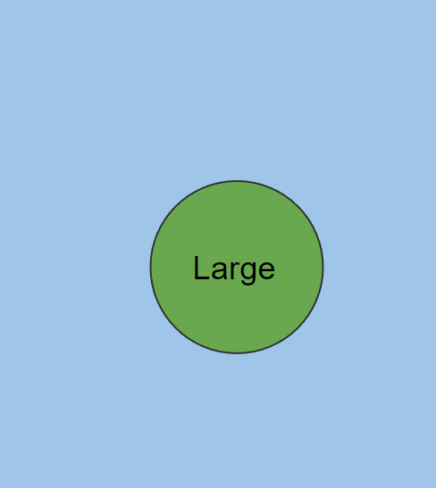

Figure 1: Recursive sub-scatter method, starting with a <code>large</code> texture placement. Each size places one or more smaller-sized features, and <code>small</code> features have a chance of placing another <code>small</code> feature.

Let’s get into more detail about how this works, using fig. 1 as an example.

#### Size categories
The Geology Service currently supports four different size categories: `huge`, `large`, `medium`, and `small`. Each size comes with its own settings that control:
* The likelihood of picking this size as the “first placement”
* The relative height range this size is allowed to fall within
* The number of smaller features this size attempts to scatter nearby
* The distance away from this feature that sub-scattered features will be placed

#### First placement
First of all, we have to work out the details for that first placement. We have a few things to consider. 

1. **What size should we start with?** We randomly choose a size based on the [`size]_rate` settings. These rates are treated as _weights_, meaning that we add all the weights together to get a _total weight_, and the probability of selecting each size is that size’s weight divided by the total weight. For example:

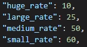

In this case, the _total weight _is 10 + 25 + 50 + 60 = 145. Therefore, there’s a 10 ÷ 145 ≅ 7% chance of choosing a huge texture, a 25 ÷ 145 ≅ 17% chance of a large texture, etc.

2. **Where should it go in the world?** The first placement can only successfully be placed in the biome specified by `place_on_biome`. We randomly select any location in the world that satisfies this constraint.

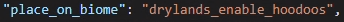

3. **How tall should it be?** We randomly select a height scaling factor in the range specified by `size_relative_height`. In our example from fig. 1 where we chose a `large` texture, we would choose a scaling factor between 0.2 and 0.6. See relative height for more details.

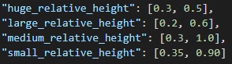

4. **Which texture should it use?** Textures are randomly selected from each size category. In this particular case, there is only one `large` texture to choose from, so we know we’ll be using `tex_stamp_hoodoo_large_01`.

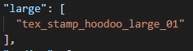

Once we’ve chosen these parameters for the first placement, we move onto the sub-scatter.

#### Sub-scatter
Now we have some considerations for sub-scattering.

1. **How many smaller features will we attempt to place nearby?** Each placement size specifies a range of smaller placements to place.

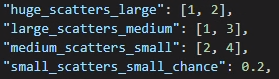

Our first placement was a `large` placement. Therefore, it will automatically attempt to scatter between 1 and 3 `medium` placements nearby. (In fig. 1, we can see that our large feature scattered 2 `medium`s.)

2. **How far away should those smaller features be from this one?** There is a displacement range setting for each size.

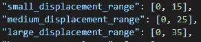

We started with a `large` feature, so now we’re placing `medium` features. According to the data above (`medium_displacement_range`), each one will be randomly placed between 0 and 25 blocks away, in a circular radius.

#### Recursion
Now, the trick is this: **each placement repeats this entire process**. That means 

* `huge` features place `large` ones, 
* `large` features place `medium` ones, 
* `medium` features place `small` ones,
* `small` features may place other `small` ones (subject to `small_scatters_small_chance`)

The logic for each placement starts from here (i.e. we ignore steps 1 and 2 of the “first placement” because we already know the sizes and we know we’ve started in the correct biome).

This recursive process leads to interesting clusters of features (like the clusters seen in fig. 1), where the intersection of multiple texture stamps can create very complex geological shapes.

### Textures
<table>
  <tr>
   <td>
   </td>
   <td>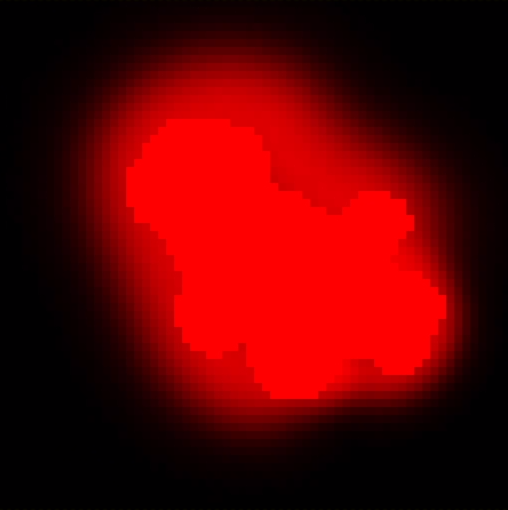
   </td>
   <td>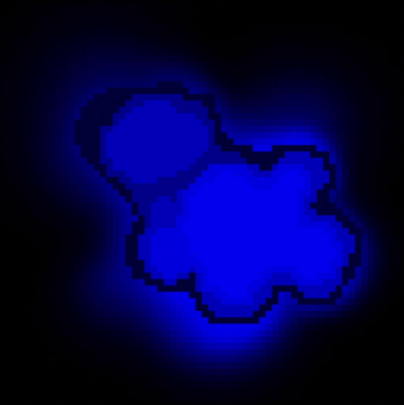
   </td>
   <td>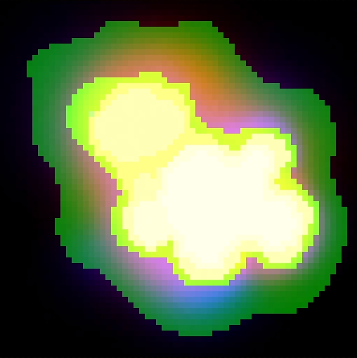
   </td>
  </tr>
  <tr>
   <td>Figure 2: Biome channel
   </td>
   <td>Figure 3: Blend channel
   </td>
   <td>Figure 4: Height channel
   </td>
   <td>Figure 5: Combined channels
   </td>
  </tr>
</table>

Figures 2-6 pertain to the texture `falloff_textures/hoodoos/tex_stamp_med_02`. 

The textures that get placed by the Geology Service aren’t 100% literal translations of the original textures – that is, they are modified by a few factors.

#### Biome height
Each pixel of a texture will correspond to a biome (fig. 2) and a height (fig. 4, taking values 0-255, re-mapped to a range specified by the biome’s `height_params` attribute). _Please note that this data lives in each biome’s data _(`behavior_packs/badger/biomes/`).

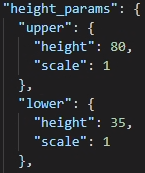

The light green part of figure 2 corresponds to the `drylands_hoodoos_small` biome (as specified in the `biome_map` of fig. 6). That biome’s `height_params` attribute specifies that the 0-255 height values from the height channel should instead correspond to heights from 30-80. That is, a 0-valued pixel in that biome represents an in-game height of 30, while a 255-valued pixel represents an in-game height of 80.

#### Relative height
Each placement gets randomly assigned a relative height. This has the effect of **narrowing** the biome’s height ranges for that particular feature by the specified amount. For example, we can see here that a `large` feature ends up with a relative height between 0.2 and 0.6. Let’s say we randomly choose the value 0.5. That means instead of a biome height range being re-mapped from 30-80 (width = 80 - 30 = 50), this placement will have those heights re-mapped to the range 30-55 (because the new width = 0.5 * 50 = 25, which is our new width – the lower height remains constant).

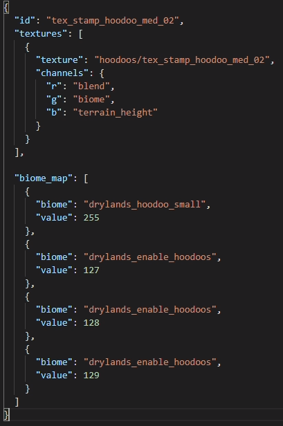

Figure 6: <code>tex_stamp_hoodoo_med_02.json</code>

#### Blend
The blend channel (fig. 3) works the same way in the Geology Service as it does in other placement textures. The 0-255 values are remapped to 0-1, where 0 means “use the existing world height here, 100%”, 1 means “use the (remapped) texture height here, 100%, and 0.5 means “blend the existing world height and the remapped texture height here, 50%-50%”.

#### Biome
There is a somewhat complex logic behind determining which biome gets placed at each pixel. Geology types have prioritized “placement biomes”, meaning that textures can place any of these biomes, but higher-priority biomes (ones earlier in the list) will _overwrite_ lower-priority biomes **if the in-game (calculated) elevation at the point associated with the higher-priority biome is higher than the previous in-game elevation.** (There is an optional setting, `biome_always_takes_priority`, that causes this system to ignore the elevation check and will _always_ switch to the higher-priority biome when given a chance.)

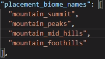

In this example, when textures are overlapping,
* `mountain_summit` can overwrite `peaks`, `mid_hills`, and `foothills`
* `mountain_peaks` can overwrite `mid_hills` and `foothills`
* `mountain_mid_hills` can overwrite `foothills`

#### Height
The height that appears in-game is the _maximum_ of the given texture height and the previous in-game height – that is, **a geology texture can never reduce the terrain height**.

## Other features
### Minimum group spacing
It is often desirable to enforce some minimum spacing between first placements so that there is likely to be some “empty space” between geology groups. This optional setting, measured in blocks, allows us to enforce that minimum spacing, meaning that if a first placement would otherwise succeed, but it is too close to another first placement, it will instead fail.

### Corner biome checks
It can be disruptive if a geology texture spills over into another biome. This can happen because, by default, we only check to ensure that the center of a geology placement is in the correct biome. These settings allow us to also perform checks on the corners of a proposed geology placement, allowing us to fail a placement that would spill out of the intended biome group.

#### Tag check
The biome test at each corner succeeds if the biome located at that position in-game has the tag specified by `biome_tag`. For example, **all** of the mountain biomes have the `mountain` tag, so if a mountain texture would have its corner place in **any** of the mountain biomes, that test would succeed.

#### Minimum corners to pass
Sometimes we might want to allow a geology placement to succeed if some or most of its corners would end up in an appropriate biome. In this case, we can specify the minimum number of corners for the placement to succeed.

### Rare texture
Sometimes, we may wish to place a single instance of a special texture in the world. If we provide `optional_rare_texture_name`, that texture will appear exactly once in the world. If this initial placement succeeds, it is treated as a first placement and will sub-scatter smaller features as usual.

#### Size category
It is recommended that the optional rare texture is the only texture in its `[size]` category – if it isn’t, the Geology Service will randomly select from among all_ _of the textures in the same size category as the rare feature (and an assert will be thrown). Note that if the `optional_rare_texture_name` does not appear in **any** of the `[size]` categories, an assert will be thrown.

#### Placement restrictions
The rare texture will only successfully place in an area where the entire texture footprint lies upon the specified place-upon biome. The Geology Service will attempt to find a location that satisfies this restriction `max_attempts_rare_placement` times, after which the placement will fail and the system will move on to regular group placements.

### SDF shape locators
The Geology Service can interface with the SDF Shape Service, allowing us to create even more complex terrain. Jungle mountains use this technology extensively. Adding new geology types that combine with SDF shapes requires code support, so if this interests you, please reach out to a world engineer to discuss your ideas.

## Adding new geology types
Each `json` file within `data/behavior_packs/badger/gamelayer/server/world_gen/geology/` describes a unique geology type. To add a new geology type to the game, you can duplicate one of the existing `json` files, then modify the data within as needed. 

You will likely want to create new textures that your new geology type will reference. The textures live in sub-folders of `data/behavior_packs/badger/falloff_textures/`. For example:

## Data
### settings
The main body, where the general settings are found. If a default value is specified, the setting is not required.

#### enabled (bool)
Determines whether this geology type will appear in the world.

#### allow_village_overlap (bool – default is false)
Determines whether other world gen placements are allowed to overlap with this geology type. This could lead to strange interactions so it is recommended to leave it set to `false` unless you test thoroughly with overlapping placements.

#### biome_always_takes_priority (bool – default is false)
See Biome for explanation.

#### attempts_per_square_kilometre (int)
Determines the number of group placements to attempt to place. Larger numbers mean more geology placements.

#### placement_biome_names (list[string])
Determines the priority of biomes that will appear in this geology type’s textures. Earlier in the list means higher priority. See Biome.

#### place_on_biome (string)
The biome that this geology type may place upon.

#### place_on_biome_parent (string)
The “parent” biome name that this geology type may place upon (e.g. if `place_on_biome` is `drylands_enable_hoodoos`, the `place_on_biome_parent` should be `drylands`).

#### biome_tag (string)
A valid biome tag. See Corner biome checks.

#### min_texture_corners_in_correct_biome (int [0, 4] – default is 0)
The minimum number of corners that must appear within the appropriate biome. See Corner biome checks.

#### min_distance_between_groups (int – default is 0)
A minimum distance in blocks that groups’ first placements must respect, relative to every other first placement. See Minimum group spacing.

#### max_attempts_to_find_group_pos (int – default is 1)
For each placement group, how many times to attempt to find a position that satisfies the `min_distance_between_groups`.

#### max_failures (int – default is ∞)
During geology group placement, if we encounter this many failures due to violating group spacing or corner biome checks, we quit feature placement early.

#### max_group_size (int – default is "no max size")
Cause recursive sub-scattering to stop early if we reach a particular group size.

#### [size]_displacement_range (IntRange [min, max])
A recursively-scattered feature of size `[size]` will be placed between `[min]` and `[max]` blocks away from its parent.

#### [size]_scatters_[smaller-size] (IntRange [min, max])
A feature of size `[size]` will place between `[min]` and `[max]` placements of size `[smaller-size]`.

#### small_scatters_small_chance (float)
The probability that any small placement will sub-scatter another small placement. Note that things can get a little out of hand if this number is sufficiently large.

#### [size]_rate (int)
The relative weight for size `[size]`. See “what size should we start with?”

#### [size]_relative_height (FloatRange [min, max])
The relative height range for size `[size]`. Each placement will randomly select a value between `[min]` and `[max]`. See Relative height.

### texture_registry
This attribute holds a small number of texture-specific settings, as well as lists of all textures that may be used for this geology type. If a default value is specified, the setting is not required.

#### texture_key (string)
The name of this geology type, e.g. “hoodoos” or “jungle_mountains”. _Used for debug/logging text only._

#### optional_rare_texture_name (string – default is "" [empty string])
The name of a texture that should appear only once in the world. The name must match one of the textures listed in a size category below, and that texture should be the only texture in its size category. See Rare texture.

#### max_attempts_rare_placement (int – default is 1)
The number of times we will attempt to find an appropriate location for the given rare texture.

#### [size] (list[string])
Lists of textures of size `[size]`. Every texture in a given category should be the same _actual size_ for corner biome checks to work properly.

#### [size]_texture_size (int)
The pixel dimensions of the textures for the given category `[size]`. These sizes must be accurate for corner biome checks to work properly. Note: it is assumed that all textures used are square.

## Notes
`[size]` is one of { `huge`, `large`, `medium`, `small` }.
