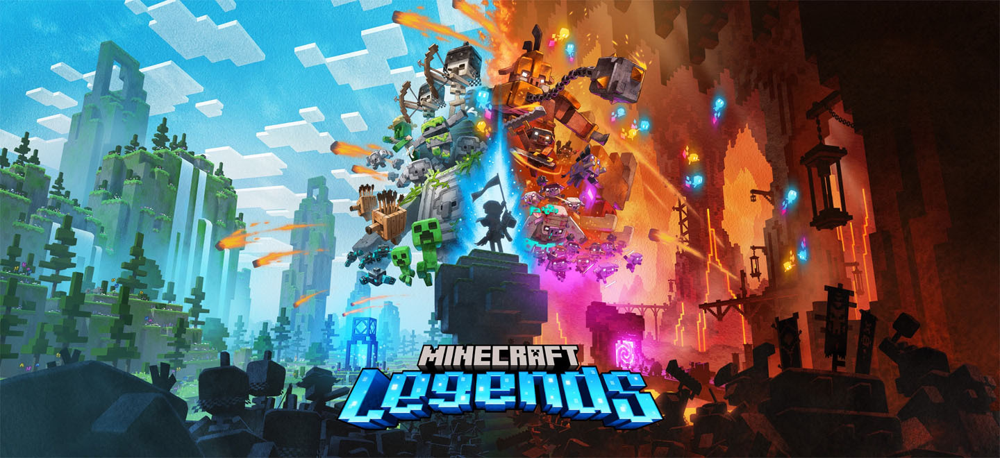

# Minecraft Legends Documentation
This repository houses the documentation for Minecraft Legends. It will help you understand how the data is laid out and how to make your own mods for the game.

Watch this space as we're planning on releasing more documentation in the future. For now, you can check out the entry below which describes all of the behaviours available to entities in the game.

## Entities
From Piglins invading the overworld to allays gathering resources, all of the Minecraft Legends gameplay comes from entities. You can think of them as things that have behavior and may or may not have a visual representation. They are defined in JSON files and split across Behavior packs and Resource packs.

More documentation can be found on the [entities page](Entities.md).

## Village Generation
Villages and Bases are key components to the campaign mode in Minecraft Legends. These locations are procedurally generated using the deck system which draws actions cards to create the final set of structures. This system is described on the [village generation page](VillageGeneration.md).

## Geology Service
[The Geology Service](GeologyService.md) is a system that lets us place special “geology” textures in the world. It allows us to generate terrain features that we could not easily achieve with our standard procedural terrain generation.

## BSharp
The bulk of the heavy lifting in the campaign mode is accomplished through our scripting language called BSharp. It is built on JavaScript and can do quite a lot of powerful things in the game. Check out the [BSharp Reference Sheet](BSharpReferenceSheet.md) for more information.
