# Minecraft Legends Village Generation
## Village Planning 
### Order of Operations 

Village planning is done in the following sequence of steps.

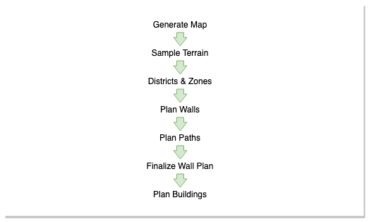

These steps often correspond to different kinds of cards. When a village deck is processed, the village generator will handle particular kinds of cards during different steps. For instance, all the District and Zone cards are handled during the Districts & Zones phase. This is true regardless of where those cards exist in the deck.

Cards of the same type will be handled in the order that they’re pulled off the deck. For example, the first buildable card in the deck will be the first buildable card that’s handled. This is important to keep in mind while assembling village generation decks. Buildables will often be competing for space in a village so it’s a good practice to request larger buildables first to ensure they have a good chance of placing.

To increase readability of B# scripts, it is best practice to organize B# scripts so that village generation decks are assembled in this order even though the village generator will automatically enforce an order regardless.

## Village Features 
### Districts 
All villages are composed of one or more districts. Each district is a collection of zones, but when a new district is placed, it will just exist as a position with a district name until zones are added to it. When a village is first created, a main district will be automatically created at the village’s starting position. Every zone that gets added to the village, will belong to a particular district.

#### District Cards 
To create a new district, add a card from the district_cards library to the deck. Multiply that card with some placement preference cards to influence where the new district should go relative to the main district.
After creating a new district, to add zones, buildables, walls, moats, etc to the district, multiply the card for the new request with the district card. If no district card is multiplied, the main district will be used as the default.

Card Library Name

**district_cards**

Settings

**district**

The unique name that identifies the district. When zones are added to a district, the district name will be added to their zone tag set. Every zone that belongs to the district will have the district name as part of their tag set.

Example

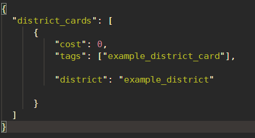
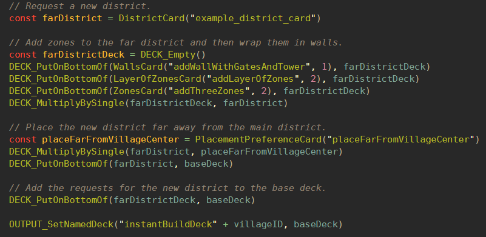

### Zones 
The zones that belong to the village districts organize the area inside the village and they provide the space to place village features like buildables. To add zones to a village district, there are two types of cards available, zones_cards and layer_of_zones_cards.

#### Zone Cards 
These cards will add one or more zones to a village. The first zone added will use any placement preferences multiplied with the zone card to find the best zone (the zone with the highest score). If the number of zones requested is greater than one, we’ll continue trying to add zones that are adjacent to the first zone added until we’ve either run out of connected zones that aren’t already part of the village, or we’ve added the requested number of zones.

Card Library Name

**zones_cards**

Settings

**number_of_zones**

The number of zones that should be added to the village.

Example

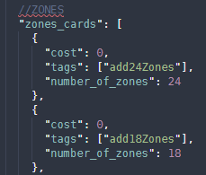

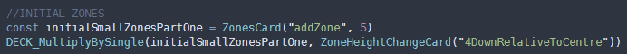

Note

* Zones are always added to a district. If no explicit district is specified, the main district is used by default.
* Placement preferences can be used to specify where zones should be added to the village.
* If **number_of_zones** is greater than 1, after the first zone is added, the zones neighboring that zones will be added until the amount requested has been added.
* Only zones that aren’t already part of the existing village will be considered.
* **zone_tag_cards** can be combined with **zones_cards** to reserve zones for particular features like paths, structures, etc.

#### Layer of Zones Cards 
When this card is handled, it will add all the zones that border the existing village district that this card is being applied to. If no district card is specified, the default main district will be used.

Card Library Name

**layer_of_zones_cards**

Settings

None

Example

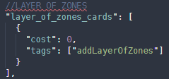

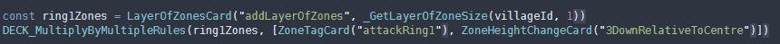

Note

* Layers of zones are always added to a district. If no explicit district is specified, the main district is used by default.
* The outer layer of zones around all the district zones that aren’t part of the village yet will be added to the district.
* **zone_tag_cards** can be combined with **layer_of_zones_cards** to reserve zones for particular features like paths, structures, etc.
* If your layers of zones get weird zones that stick out from them, look into the **minimum_loz_connection_width** setting. 
(Found in the village_zone component.  ie. in piglin_obstacle_large.json under **badger:village_zone**)
Layers of zones by default try to avoid having tight pinch points in the ring it creates, and tries to add zones to pad out thin sections.  It can cause issues specifically with hex based zones.

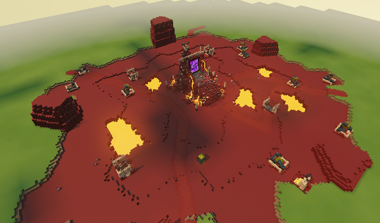

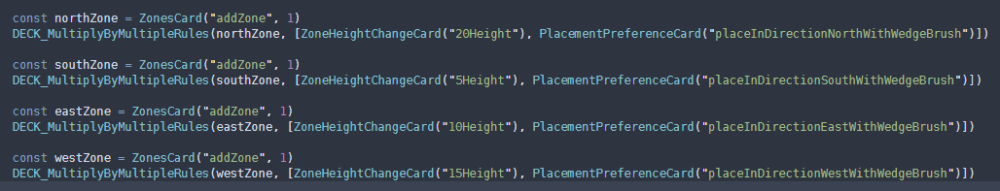

_In this example, four raised zones are added to the north, south, east, and west using directional placement preference cards._

#### Zone Tag Cards 
When zones are added to a village district, they can be given one or more tags so that they can be identified later with a card from the zone_filter_cards library. Multiply a card from the zones_cards library or the layer_of_zones_cards library with a card from the zone_tag_cards library to add that tag to the zone tag set.

Library Card Name

**zone_tag_cards**

Settings

**zone_tag**

The name of the tag that should be added to the tag set of the zone(s) that it’s applied to.

#### Zone Filter Cards 
When a village feature needs to be placed in zones that have been given a specific zone tag (see zone_tag_cards), a card from the zone_filter_cards library with a zone_filter that matches the zone tag should be multiplied with the village feature card. For example, if a group of zones have been multiplied with a zone tag card with a zone_tag of “tower town”, multiplying a card from the buildable_cards library with a zone_filter_cards card that has a zone_filter of “tower town” (and exclude set to false) will limit the zones that the buildable can place in to the “tower town” zones.

Card Library Name

**zone_filter_cards**

Settings

**zone_filter**

The zone tag name to filter zones by.

**exclude**

Specifies where the zone_filter zone tag name should be used to exclude or include zones. This can be true or false.

#### Zone Height Change Cards 

When multiplied with cards from the zones_cards and layer_of_zones_cards libraries, the zones added to the village will raise or lower the height of the terrain inside the zone depending on the settings specified on the zone height change card.

Card Library Name
**zone_height_change_cards**

Settings

**zone_height_change**

The distance in blocks that the terrain inside this zone will be raised or lowered. This value can be positive or negative.

**biome**

The name of the biome that this zone should be changed to. This is optional.

**zone_height_control**

This specifies how the zone_height_change should be applied. The options are:

* “height_control_centered” - Relative to the original zone height of the first zone that was added to the village.
* “height_control_averaged” - Relative to the village average zone height of all the zones in the entire village map. This includes zones that haven’t been added to the village.
* “height_control_lowest” - Relative to the lowest zone in the group of zones being added with this particular request.
* “height_control_none” - Relative to the original zone height of the zone being raised or lowered.

#### Moats and Pools 
Moat cards can be used to either create a moat that encircles a village district or a bunch of individual lava pools.

#### Moat Cards 
Card Library Name

**moat_cards**

Settings

**biome**

The name of the biome that will exist inside of the moat zones that get added when this card is played. The particular types of blocks that will exist inside of these moat zones will be determined by the biome.

**width_in_blocks**

How wide the moat should be in blocks. The moat will claim as many zones as it needs to meet the requested block width and then the edges of the moat will be displaced inward to reduce the width of the moat if the zone additions resulted in a width that's larger than the requested width.

There are a number of other village generation settings that affect the zone sizes (grid shape, zone jitter) and the moat edges (edge noise) so this new setting will need to be tuned with those others in mind.

**filling_depth**

[not used] The **biome** now determines what blocks go where inside the moat zone.

**distance_in_zones**

The distance in zones from the district that the moat will be placed around.

Example

Note
* If distance_in_zones is 0, a moat will not be placed. Instead, all the zones that have been tagged (using zone_tag_cards) with a **“lava_option”** tag will be turned into a pool.
* If distance_in_zones is greater than 0, an external moat will be placed around the district specified. If no district has been explicitly specified using one of the **district_cards**, the main district will be used by default.
* Use **zone_height_change_cards** to control the height of the moat zones.

### Walls 
Wall cards can be used to place walls along the edges of village zones.

#### Wall Cards 
To place walls, first multiply all the zone cards that you want to place walls around with a zone tag card. Then multiply a wall card with a zone tag filter card with the same zone_tag_filter tag.

(Optional) If you want wall fragments / gaps in the wall, you can multiply the wall card with a placement preference card(s) and a threshold card. This will score the zones that the wall would be placed around and if a zone score is less than the threshold, that zone won’t get a wall.

The best way to create a gate or entrance in a set of walls is to request a path that connects the zones inside the walls (using the same zone tag) to some zones that are outside of the walls. The wall that the path crosses will be replaced with a gate.

Note
* When terrain weathering is applied, walls can slip off the side of weathered edges. To avoid this, there is a wall_offset setting in the badger:village_wall component. This offset will move walls away from the edge. If it’s tuned greater than the maximum terrain weathering amount, that should ensure walls don’t slip.

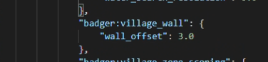

Card Library Name
**wall_cards**

Settings

**wall_buildable**

The name of the buildable to place for the wall.

**path_entrance**

The name of a buildable. If a path crosses this wall, the wall segment that’s crossed will be removed and replaced with this entrance buildable. Usually this is a gate buildable.

**embedded_buildables**

A list of buildable names. When the wall is placed, each one of them will be placed at random locations along the wall if there’s room. It’s not recommended to use these for entrances. It’s better to use path cards so that gates will be placed in locations that can connect with the path.

### Paths 
Path cards are used to place paths that connect village zones. To connect a buildable to a path, see the build_from_district_path and connect_to_path placement preference cards.

#### Path Cards 
path_cards need to be set up in a particular way before they’re added to the deck so that they’re handled correctly later when the deck is processed. For this reason, there is a special B# helper method to request a path that will connect two village zones, CreatePathRequestOnBottomOf.

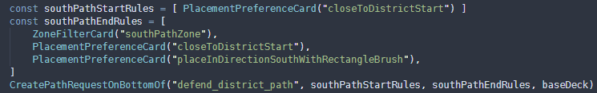

The first parameter takes a tag identifier for the path card that will be used. In this case “defend_district_path”. The second and third parameters take arrays of rule cards that will be used to identify the best start and end zone for the path. The final parameter takes the deck which this new path request will be put on the bottom of.

The rule cards function in the same way as when they’re multiplied with zone, district, or buildable request cards. Zones will first be filtered and any placement preferences will be used to score the remaining zones so that we can find the best / highest scoring zone. This is done for the path start and path end.

There is also another special B# helper function if you want a path that connects a village zone to the closest path to that zone, CreatePathFromZoneRequestOnBottomOf.

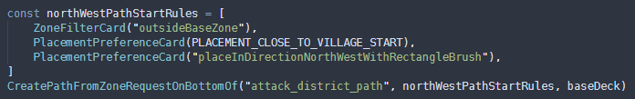

The first parameter takes a tag identifier for the path card that will be used. In this case “defend_district_path”. The second parameter takes an array of rule cards that will be used to identify the best zone for the path to start in. Since the path will connect to the closest existing path, there’s no need for the additional array of rule cards that the CreatePathRequestOnBottomOf method takes. The final parameter takes the deck which this new path request will be put on the bottom of.

Note
* Bridges will be placed when the path connects two zones with a body of water or when the path connects two zones that have a large enough height change.
* Gates will be placed when the path crosses a wall.
* Bridges failing to place can cause paths to fail too.  Adding a **force_building_placement_cards** card on either set of path rules passed into the CreatePathRequestOnBottomOf call will place the path without bridges if it would fail otherwise.  This is currently used by defend bases to ensure gates appear even if bridges won’t.

Card Library Name

**path_cards**

Settings

**is_district_path**

If this is set to true, the path created with this request will use the path settings defined in the village_district_path component on the village entity. Otherwise the settings in the village_building_path will be used. An assert will be triggered if the component needed doesn't exist.

Example

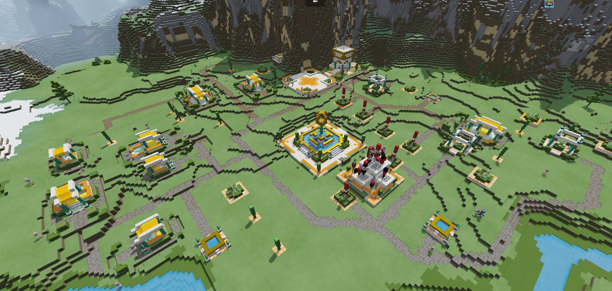

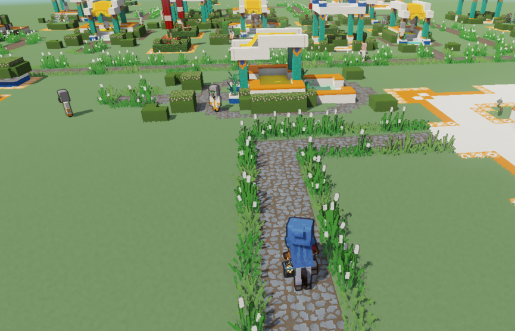

### Terrain Weathering 
Without terrain weathering, zone height changes will result in a lot of straight and perfectly smooth cliffs. Village weathering cards help rough them up a bit. The effect is a combination of a sawtooth wave layered with gradients and a lot of noise.

#### Terrain Weathering Cards 
Adding this card to a village generation deck will apply terrain weathering to all the edges of zones that have been raised or lowered with height change or moat cards. The terrain weathering card doesn’t have any settings. See the badger:village_weathering component for the terrain weathering settings.

Card Library Name

**terrain_weathering_cards**

Settings

None

Example

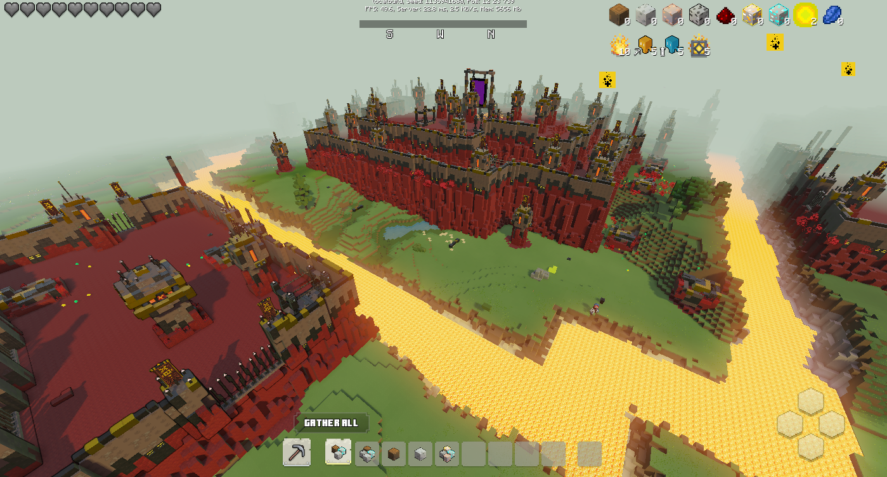

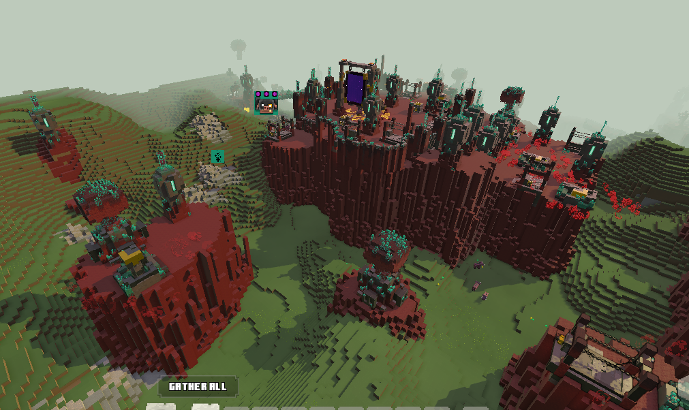

### Buildables 
Buildables (aka structures or buildings) are requested using buildable cards.

#### Buildable Cards 
Cards from the buildable_cards library are often multiplied with district, placement preference, and zone filter cards to control where they get placed in the village.

Note
* It’s best practice to add the largest, most important buildable cards to the deck first. Buildables will be placed in the order that the cards are pulled from the deck. If smaller non-critical structures are placed first, they might space out and take up the room needed to place the larger structures.
* Buildable cards are the only kind of village feature card that can be handled after a village is done in generating for the first time. For example, when piglin bases respond to player attacks in campaign or when they rebuild in PvP.

Card Library Name

**buildable_cards**

Settings

**buildable**

## Placement Preference Cards 
In general, placement preference cards should be multiplied with other cards like district, path, wall, zone, and buildable cards to change how those cards get handled.

Card Library Name

**placement_preference_cards**

### Circle Sine Wave 
This placement preference will use the angle between the zone positions and the district start position to sample from a sine wave. The result from that sine wave is shifted so that the placement preference will by default add a score between 0 and 1 to the zone being scored.

Name

**circle_sine_wave**

Settings

**amplitude**

By default, the circle_sine_wave placement preference will add a score between 0 and 1. This score will be multiplied with the amplitude. As a result, the amplitude can be used to increase or decrease the effect that this placement preference has on the final score.

**frequency**

The frequency determines the number of times the sine wave oscillates between 0 and 1 over the 0 to 360 degree range.

Example

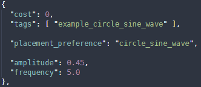

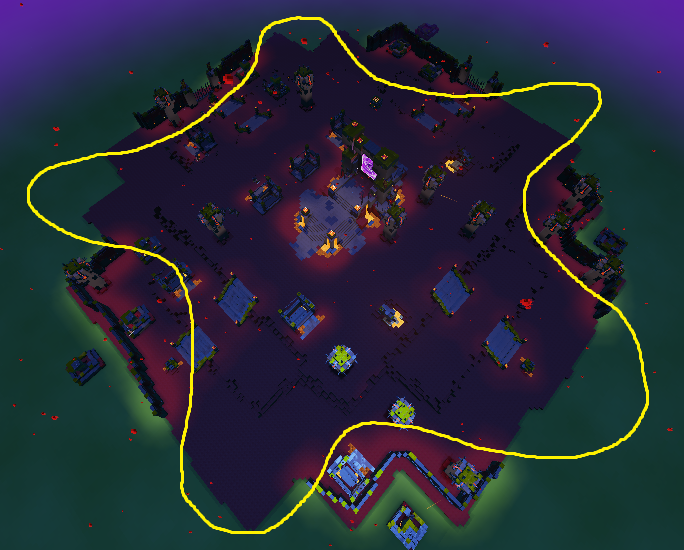

When combined with a wall request card and a threshold card, circle_sine_wave can be used to create fragmented walls. The yellow lines are how I like to visualize the sine wave as it affects the scores of the zones.

### Close to Buildable 
Zones will be scored higher if they're close to the buildable specified.

Name

**close_to_buildable**

Settings

**buildable**

The tag for the buildable to place close to. This should match one of the tags in the “tags” list in the badger:tags component for that buildable entity.

Example

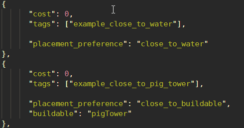

In this example, the towers are requested close to the buildable with the “pigGate” tag. 

### Close to District Center 
This placement preference will score zones higher if they’re closer to the barycenter of all the district zones. The closest zone(s) will be given a score of 1, the farthest zone(s) a score of 0, and all the other district zones will be given a score in between 0 and 1 depending on how far they are from the center.

Note
* The district center will update each time a new zone is added to the district. That means the center will be continuously changing until all the zones have been added. Using the close_to_district_center before all the zones have been added may have some surprising results.

Name

**close_to_district_center**

Settings

None

Example

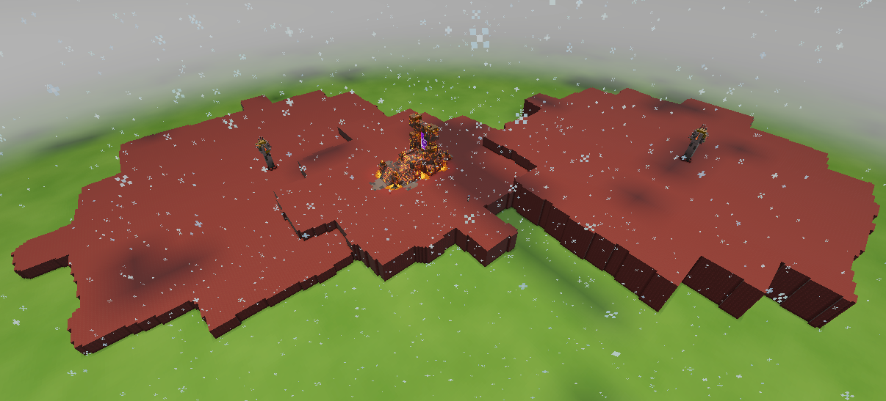

This example base has a main district in the center, a separate district on the left that's lower than the main district, and a separate district on the right that’s higher than the main district. All the zones in the district on the left were added with the close_to_district_start placement preference. All the zones in the district on the right were added with the close_to_district_center placement preference. Likewise, the tower in the district on the left was requested with the close_to_district_start placement preference and the tower in the district on the right was requested with the close_to_district_center placement preference.

### 
Close to District Start 

The close_to_district_start placement preference will score zones higher if they’re closer to the zone that was added first to the district. The zone that was added first will contain the starting position and will be given a score of 1. The farthest zone(s) from the starting position will be given a score of 0 and all the zones in between will be given a score between 0 and 1 depending on how far they are from the start.

Name

**close_to_district_start**

Settings

None

Example

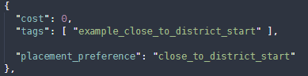

### Close to Influence 
This placement preference will score zones higher if they’re close to a particular unit that has the “badger:village_influence” component. This can be used to place buildables near attacking enemy mobs or friendly mobs during gameplay.

Name

**close_to_influence**

Settings

**alliance_rule_filter**

Indicates what units should influence this placement preference. Possible values include “enemy”, “friendly”, and “any_team”.

Close to Village Start

The placement preference is the same as the close_to_district_start placement preference. It exists because it was added before it was possible to have multiple districts in a village.

Name

**close_to_village_start**

Settings

None

### Close to Walls 
Score zones higher based on the number of walls bordering them.

Note
* The close_to_buildable placement preference can be used for the same purpose if a wall tag is specified for the “buildable” setting. This close_to_wall placement preference will only score zones higher if the zones actually have walls bordering them whereas the close_to_buildable placement preference will also score nearby zones higher even if they don’t have walls actually bordering them.

Name

**close_to_walls**

Settings

None

### Close to Water 
Zones will be scored higher if they're close to a zone containing water.

Name

**close_to_water**

Settings

None

Example

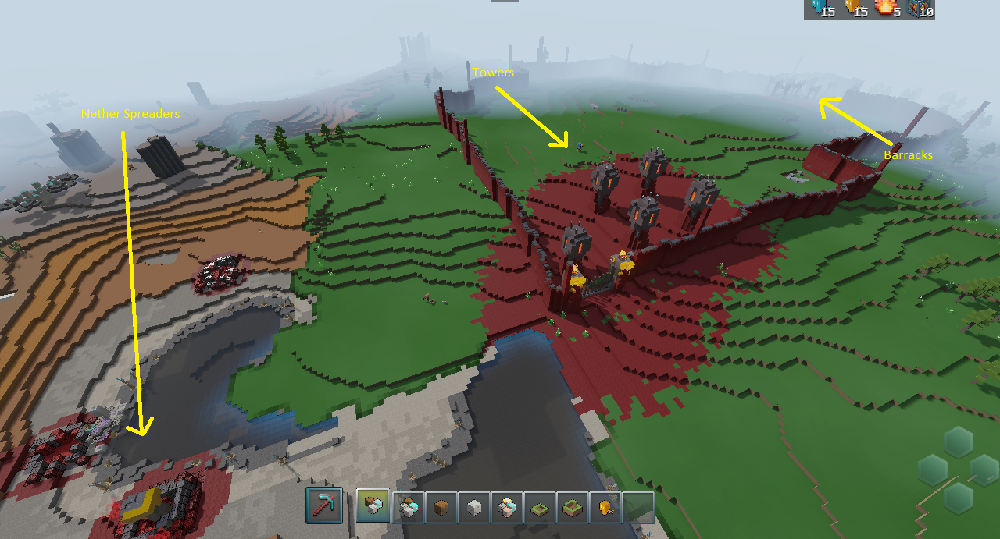

In this example, the nether spreaders were requested outside the village and close to water.

### Connect to Path 
This placement preference card can be multiplied with a buildable request card. Buildable request cards that have the “connect_to_path” placement preference will try to generate a path from the position of the buildable to the nearest path.

Note
* Since the buildable is placed and then the path is created, it’s common for the path to not be able to find or connect to an existing path because of the buildables placement. For instance, if the buildable is placed such that it’s facing another buildable, it’s likely the path won’t have enough space to place.
* The “build_from_district_path” placement preference is generally a better method for connecting buildables to paths.

Name

**connect_to_path**

Settings
None

Example

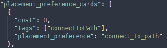

### Clear Resources In Zone 
This placement preference can be multiplied with a zone request card. Zone request cards with this placement preference will remove all the world features that overlap the zone(s) that get added to the village when the zone request card is handled.

Note
* It’s not necessary to use this card to clear world features for buildables. World features will be removed if they overlap buildables regardless.

Name

**clear_resources_in_zone**

Settings

None

### Disable Spacing 
There is a default spacing behavior that tries to distribute structures so that they don’t bunch up too much when they have a lot of room to place in. That spacing behavior is turned off for a particular buildable request if the “disable_spacing” placement preference is multiplied with that buildable request.

Name

**disable_spacing**

Settings

None

### Distance From District Start 
This placement preference will score zones higher if the distance between the zone site and the district start is close to a specified distance. This placement preference can be multiplied with district, buildable, and path requests.

Note
* This preference will be most reliable in low jitter bases. This is especially true if you are using smaller distances and tight tolerances with this preference.

Name

**distance_from_district_start**

Settings

**distance_from_district_start**

The distance (range or single value) in blocks from the district starting position that the placement should ideally be placed.

**distance_to_zero_score**

The distance from the **distance_from_district_start** until the score added to zones by this placement preference is reduced to 0. For the example card below, with placement preference will add 1 to the zones that are between 80-90 blocks from the district start. At 70-80 and 90-100 blocks the score added will be a value between 0 and 1 depending on how far it is from 80 and 90 blocks away.

Example

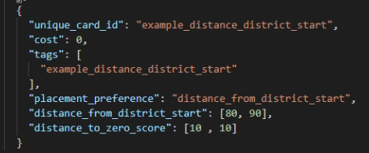

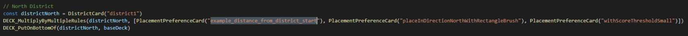

Sorry, you’ll likely need to zoom in 200% to see this one. In this example the placement preference is being used to place a district a specific distance from the village start/center. (This was used to make the screenshot below.)

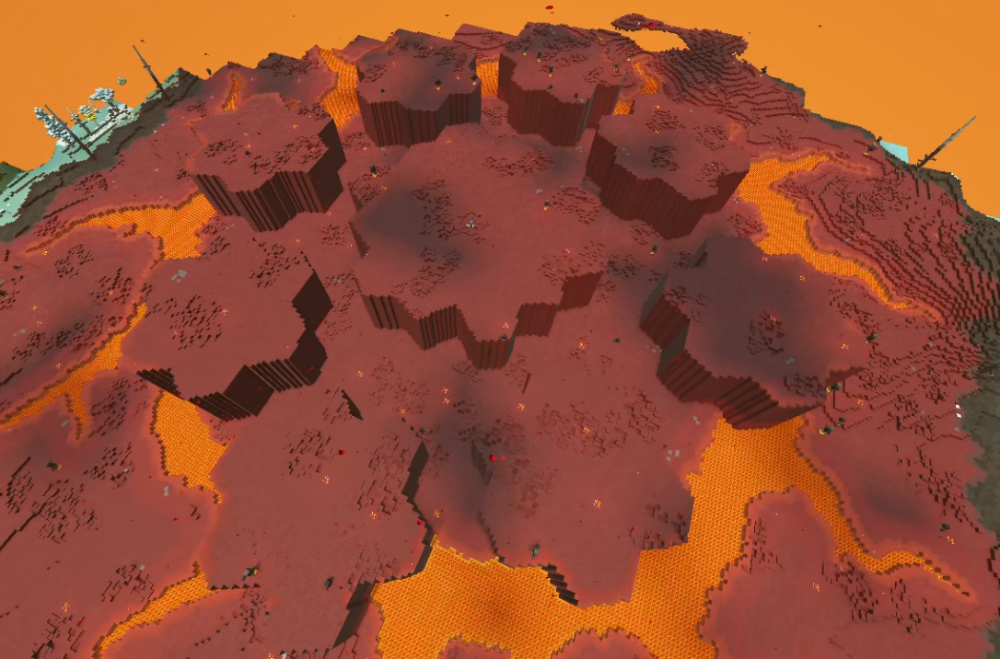

### Elevation Range 
This placement preference will score zones higher if the normalized height at the zone site is close to the specified target height.

Note
* If you aren't using a score threshold, zones that fall outside the range can still be used once good zones are exhausted, so be careful.

Name

**elevation_range**

Settings

**elevation_target**

This can be a value between 0 and 1. If a zone has a normalized height of 1, that zone is the highest zone in the village.

**elevation_max**

This can be a value between 0 and 1. It’s the upper limit for zone heights. If a zone has a normalized height that’s higher, this placement preference won’t add any score.

**elevation_min**
This can be a value between 0 and 1. It’s the lower limit for zone heights. If a zone has a normalized height that’s lower, this placement preference won’t add any score.

Example

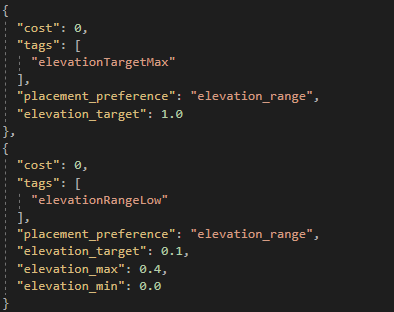

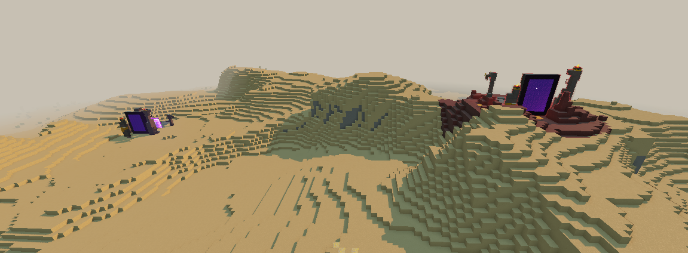

### Facing Buildable 
This placement preference can be multiplied with buildable request cards. Buildable request cards with this placement preference will try to place with an orientation that faces the nearest specified buildable if one exists.

Note
* Buildables can only face cardinal directions due to their blocky nature. If the buildable to face is north west of the buildable being placed, the placed buildable should face north or west.
* Without an orientation placement preference, buildables will choose their facing direction randomly.

Name

**facing_buildable**

Settings

**buildable**

The tag for the buildable to face towards. For example, if we wanted to create a facing_buildable card that makes buildables face the nearest fountain, we would set this setting to “fountain” because the fountain buildable has the “fountain” tag in its badger:tags component “tags” list.

Example

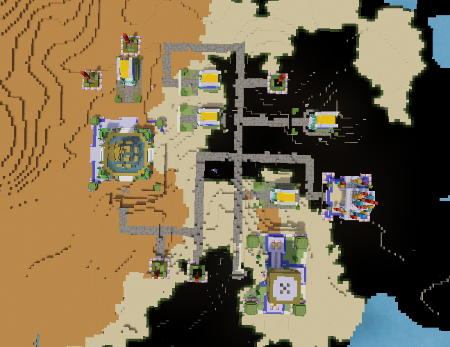

All these buildings have a facing_buildable placement preference with fountain specified as the building to face.

### Facing Influence 
This placement preference can be multiplied with buildable request cards. Buildable request cards with this placement preference will try to place with an orientation that faces the nearest source of influence that passes the specified alliance rule filter. Sources of influence will have the “badger:village_influence” component. This can be used to place buildables that face towards attacking enemy mobs or friendly mobs during gameplay.

Name

**facing_influence**

Settings

**alliance_rule_filter**

Indicates what units should influence this placement preference. Possible values include “enemy”, “friendly”, and “any_team”.

### Facing Water 
This placement preference can be multiplied with buildable request cards. Buildable request cards with this placement preference will try to place with an orientation that faces the nearest body of water if one exists.

Note
* Buildables can only face cardinal directions due to their blocky nature. If the body of water to face is north west of the buildable being placed, the placed buildable should face north or west.
* Without an orientation placement preference, buildables will choose their facing direction randomly.

Name

**facing_water**

Settings

None

Example

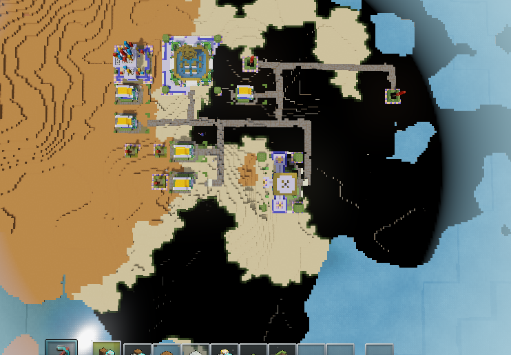

All these buildings have the facing_water placement preference.

### Facing Cardinal Direction 
This placement preference card can be multiplied with a buildable request card. Buildable request cards that have the “facing_cardinal_direction” placement preference will be rotated to face the specified cardinal direction.

Name

**facing_cardinal_direction**

Settings

**cardinal_direction**

The cardinal direction that the buildable should face. The options are north, south, east, or west.

Example

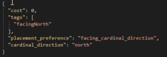

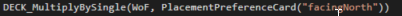

### Far From Buildable 
The far_from_buildable placement preference is the inverse of the close_to_buildable placement preference.

Name

**far_from_buildable**

Settings

**buildable**

The tag for the buildable to place close to. This should match one of the tags in the “tags” list in the badger:tags component for that buildable entity.

Example

The barracks in this example were requested far from buildables with the tag “pigTower”.

### Far From District Center 
The far_from_district_center placement preference is the inverse of the close_to_district_center placement preference.

Name

**far_from_district_center**

Settings

None

Example

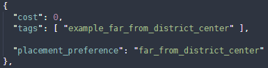

### Far From District Start 
The far_from_district_start placement preference is the inverse of the close_to_district_start placement preference.

Name

**far_from_district_start**

Settings

None

Example

### Far From Influence 
The far_from_influence placement preference is the inverse of the close_to_influence placement preference.

Name

**far_from_influence**

Settings

**alliance_rule_filter**

Indicates what units should influence this placement preference. Possible values include “enemy”, “friendly”, and “any_team”.

### Far From Water 
The far_from_water placement preference is the inverse of the close_to_water placement preference.

Name

**far_from_water**

Settings

None

### Far From Village Start 
The placement preference is the same as the “far_from_district_start” placement preference. It exists because it was added before it was possible to have multiple districts in a village.

Name

**far_from_village_start**

Settings

None

### Noise 
The noise placement preference will sample a 2D noise map at village zone positions and add the result to the zone scores.

Name

**noise**

Settings

**amplitude**

By default, the noise placement preference will add a score between 0 and 1. This score will be multiplied with the amplitude. As a result, the amplitude can be used to increase or decrease the effect that this placement preference has on the final score.

**scale**

A lower value will result in a noise map with more gradual changes. A higher value will have the opposite effect.

Example

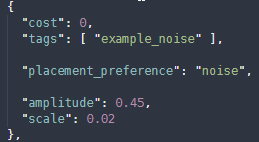

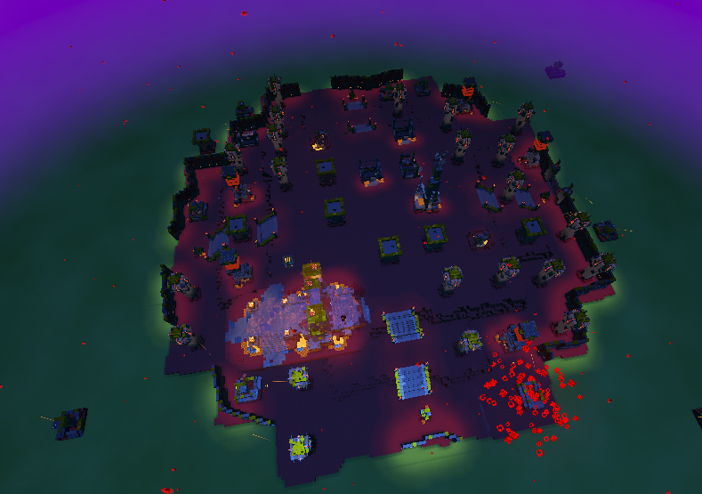

When combined with a wall request card and a threshold card, noise can be used to create fragmented walls.

### Build From District Path 
This placement preference card can be multiplied with a buildable request card. Buildable request cards that have the “build_from_district_path” placement preference will place buildables that are connected to a specified district path. This guarantees that the placed buildable is connected to a path and not facing the side of another buildable.

Note
* In village.json, there is a setting for the maximum distance allowed from the starting path zone.  This is to keep the buildable from running too far away, but tags and filters will usually kick in first.
  
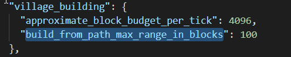

* In the village definition json (eg villager_village_001.json) the district paths need to "prevent buildable placement".  If this is turned off, paths will start cutting through buildables and removing the bottom layers of blocks.

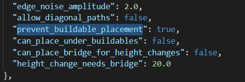

* The card is just a placement preference, and is multiplied like usual.  The main things to watch out for are that you have a valid district path to connect to, and that your tag filters/tags all agree on that.

Name

**build_from_district_path**

Settings

None

Example

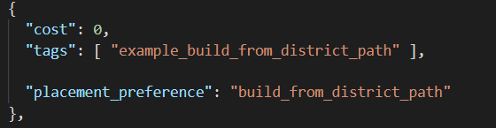

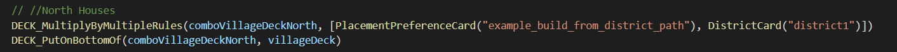

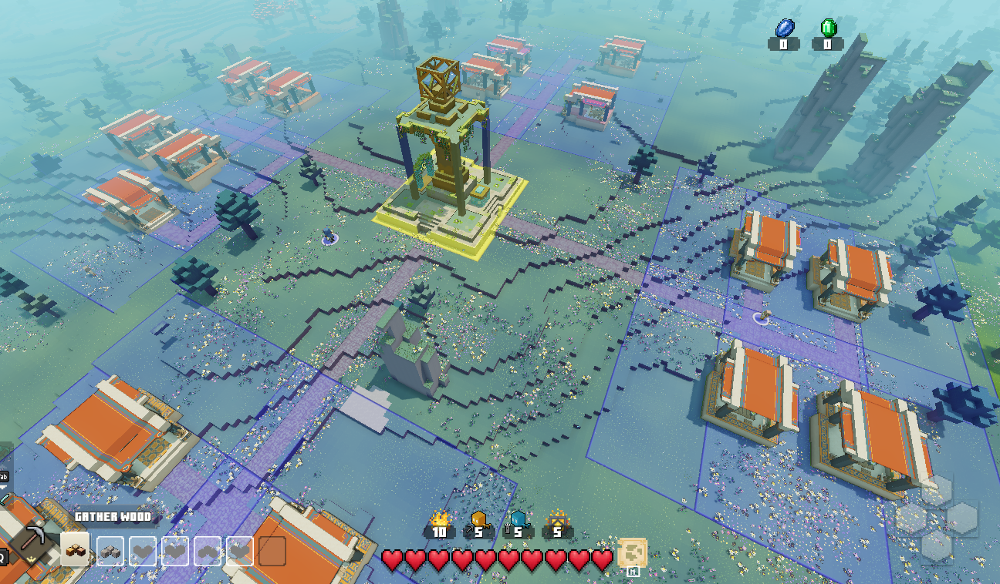

### Across Path 

This placement preference card can be multiplied with a buildable request card. Buildable request cards that have the “across_path” placement preference will place buildables on the path.

Note
* This placement preference lets buildables place on top of paths. Usually our collision checks prevent that.
* Make sure you have a path requested.

Name

**across_path**

Settings

None

Example

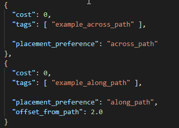

The arches use the across_path placement preference.

### Along Path 
This placement preference card can be multiplied with a buildable request card. Buildable request cards that have the “along_path” placement preference will place buildables next to a path.

Note
* This placement preference lets buildables place closer to paths than our collision checks would usually allow.
* Make sure you have a path requested.

Name

**along_path**

Settings

**offset_from_path**

The distance from the path in blocks that the buildable should place.

Example

The benches use the along_path placement preference.

### Ignore Zone Filter For Overlapping Zones 
This placement preference can be multiplied with buildable request cards. By default, when we’re checking if a buildable request with a zone filter card can be placed in a zone, if that buildable overlaps a neighboring zone that doesn’t pass the filter, the buildable won’t be placed in that location.

Note
* If the structures are failing to place, but the village looks like it has a lot of open space where they intuitively should be placed, this placement preference might help.
* The placed buildable center will still be inside a zone that passes the filter. It’s just the overlapping zones that might not pass the filter.

Name

**ignore_zone_filter_for_overlapping_zones_card**

Settings

None

### In Direction Of Influence 
This placement preference can be multiplied with buildable request cards. Buildable request cards with this placement preference will try to place in the direction of a source of influence that passes the specified alliance rule filter. Sources of influence will have the “badger:village_influence” component. This is similar to the wedge_brush placement preference except the direction is going to be towards the source of influence. This can be used to place buildables in the direction of an enemy attack.

Name

**in_direction_of_influence**

Settings

**alliance_rule_filter**

Indicates what units should influence this placement preference. Possible values include “enemy”, “friendly”, and “any_team”.

**wedge_angle**

The angle between the two sides of the wedge. This determines how wide the wedge area is. See the wedge_brush placement preference for an example.

### Random 
The random placement preference will sample a random value between 0 and 1 and add the result to the zone scores.

Name

**random**

Settings

None

### Rectangle Brush 
Zones contained inside the rectangle brush will be scored higher the closer the zone is to the middle of the rectangle. The score added is between 0 and 1.

Note
* The rectangle has an infinite length. Use this placement preference with the distance_from_district_start to limit the distance.
* Multiply this placement preference with a district card to specify the starting position of the rectangle.
* Don’t make the width smaller than the village zone_spacing or it might be possible for no zone sites to exist inside the area.

Name

**rectangle_brush**

Settings

**direction_angle**

The direction that the rectangular area will extend towards.

**rectangle_width**

The width of the rectangular area.

Example

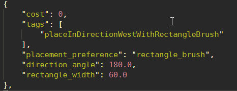

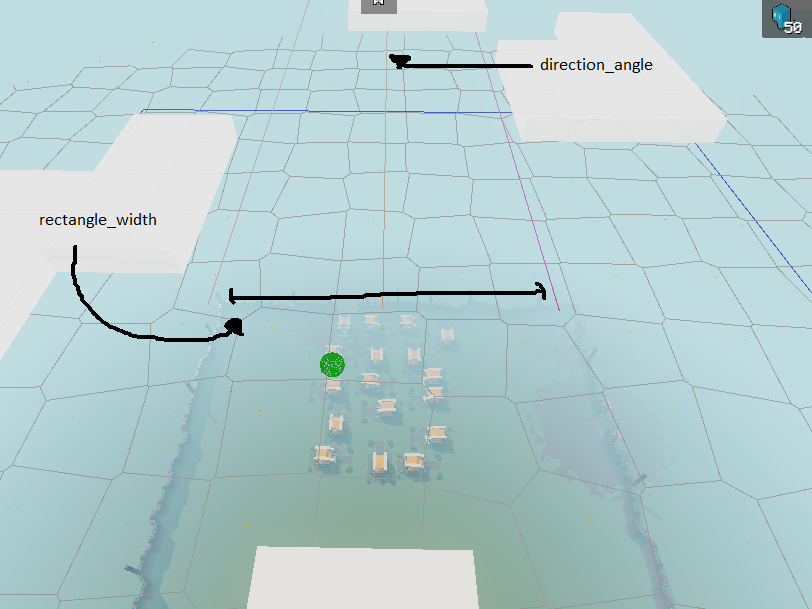

### Score Threshold 
Zones with a score less than the threshold specified on this placement preference will not be considered for the buildable, district, path, or wall being requested. If no zone exists that passes the threshold, the request will be canceled.

Note
* Only use this placement preference if it’s ok for the request to fail.

Name

**score_threshold**

Settings

**threshold**

Only zones that have a score that is higher than this threshold value will be considered.

Example

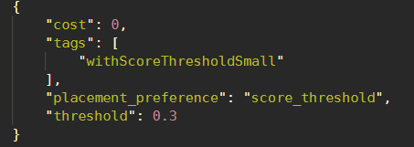

### Wedge Brush 
Zones contained inside the wedge brush will be scored higher if the direction aligns with the requested direction. The score added is between 0 and 1. 

Note
* The wedge has an infinite length. Use this placement preference with the distance_from_district_start to limit the distance.
* Multiply this placement preference with a district card to specify the starting position of the wedge.
* Don’t make the wedge_angle so small that the distance between the wedge sides might be smaller than the village zone_spacing or it might be possible for no zone sites to exist inside the area.

Name

**wedge_brush**

Settings

**direction_angle**

The direction that the triangular area will extend towards.

**wedge_angle**

The angle between the two sides of the wedge. This determines how wide the wedge area is.

Example

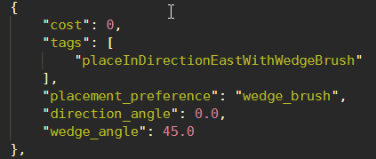

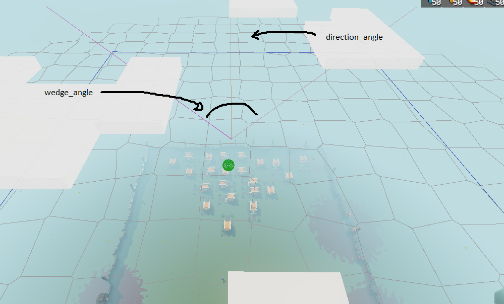

### Facing Invasion Target 
This placement preference card can be multiplied with a buildable request card. Buildable request cards that have the “facing_invasion_target” placement preference will be rotated to face the village being invaded.

Note
* This placement preference can only be used in villages that are participating in an invasion. (they need the InvasionAttack_OwnedComponent)

Name

**facing_invasion_target**

Settings

None

## Other Cards 
### Force Building Placement Cards 
Building request cards that have been multiplied with a force building placement card will ignore these constraints:

* Buildables can’t place in water
* Buildables with a zone filter card cannot place such that they overlap zones that don’t pass the filter (see **ignore_zone_filter_for_overlapping_zones_card**)
* Buildables can’t overlap paths if the path has **prevent_buildable_placement** set to true

When creating a path request with the CreatePathRequestOnBottomOf helper, if a force building placement card is added to either set of path rules, gates will still be placed along the path where the path crosses walls even if bridges fail to place. By default, if bridges fail to place, that will cause the entire path to fail which results in no gates.

Card Library Name

**force_building_placement_cards**

Settings

None

Example

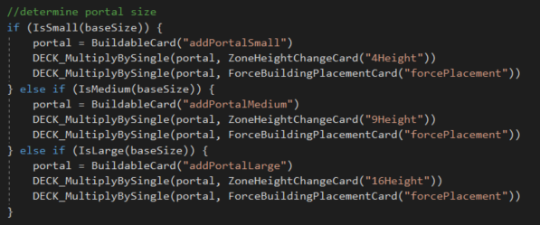

### 
Heart Cards 

Multiplying a buildable card with a heart card will make that structure a village heart. If all the village hearts get destroyed, that will destroy the village.

Library Card Name

**heart_cards**

Settings

None

### Appearance Override Cards 
Multiplying a buildable card with an appearance override card will override the visuals of the buildable. Multiplying a path card with an appearance override card will override the visuals of any bridge buildables placed by the path.

Library Card Name
**appearance_override_cards**

Settings
**horde**

The horde visuals that should be applied.

Example

The bridge belongs to the DBB horde, but the appearance is overridden with the Obstacle horde visuals.

### Hanging Decoration Cards 
[not used] Could be used to decorate the sides of zones that have been raised or lowered.

Library Card Name

**hanging_decoration_cards**

Settings

**hanging_decoration**

[not used] The name of the block type to place on the side of the raised zone.

Example

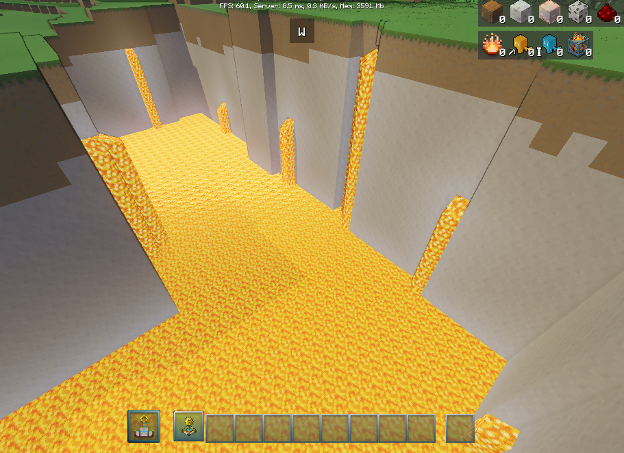

Note that we don’t have flowing liquid anymore so these lava falls won’t work anymore.

### Tag Cards 
Multiplying a tag card with a buildable card will add the specified tag to the buildable when it’s placed in the world. This tag card can also be multiplied with wall cards to add the tag to the wall and gate buildables when they’re placed.

Card Library Name

**tag_cards**

Settings

**tag**

The name of the tag to add to the buildable tag set when the buildable is placed.

### Entity Clearing Cards 
The entity clearing card will remove entities that have the right tags. Only entities inside the village bounding rectangle will be considered.

Card Library Name

**entity_clearing_cards**

Settings

**entity_include_tag_set**

Entities with these tags will be removed.

**entity_exclude_tag_set**

Entities with these tags won’t be removed.

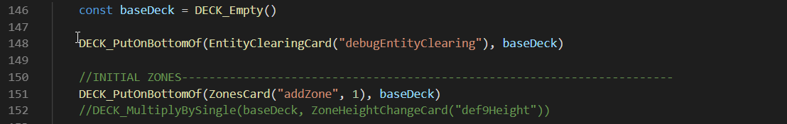

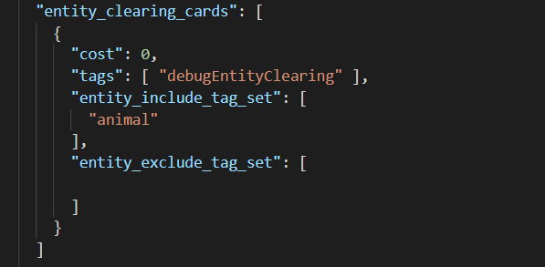

## Village Components 
Village components contain settings that often affect all the village features and placement preferences for a particular type of village.

### Village Zone 
Settings that will determine the amount of zones in the village map and the size and shape of each zone.

Component Name

**Badger:village_zone**

Settings

**zone_jitter_min**

The maximum amount that a village zone will be offset in meters.

**zone_jitter_max**

The maximum amount that a village zone will be offset in meters.

**is_zone_jitter_bell_curve_enabled**

The generation of jitter values between the min and max will have a probability distribution that approximates a normal distribution.

**zone_spacing**

The default distance between village zones before jitter is applied.

**expansion_distance**

The maximum distance that villages can expand from the central starting position.

**water_search_resolution**

The distance between each check for water while scanning the expansion area for bodies of water.

**is_hexagonal_grid_enabled**

If false, the village map will be grid with square zones. If true, the village map will be a hexagonal grid with hexagon zones.

**minimum_loz_connection_width**

The minimum edge width between zones in a layer request before padding is added.

### Village Wall 
Settings for how walls get placed when the wall cards are handled.

Component Name

**Badger:village_wall**

Settings

**wall_offset**

How far in meters to move the walls inward and away from the zone edges that they place along by default.

Village Height Change

Influences the terrain changes that are applied when the village height change cards are handled.

Component Name

badger:village_height_change

Settings

**clamp_size**

The number of blocks above a height change that are not changed to air.

### Village Bridge 

Determines how bridges are built when the village path cards are handled.

Component Name

**badger:village_bridge**

Settings

**diagonal_bridge_degree_tolerance**

The number of degrees a bridge can deviate from right angles before being considered diagonal.

**bridge_horizontal_distance_min**

The smallest XZ difference allowed between the start and end of the bridge.

**bridge_horizontal_distance_max**

The largest XZ difference allowed between the start and end of the bridge.

**bridge_vertical_distance_max**

The largest Y difference allowed between the start and end of the bridge.

**bridge_cost_per_meter**

Used to compare the cost of the bridge to the cost of a path without a bridge (paths have a fixed cost of 1 per meter). If the cost is low, there’s a greater risk of getting bridges placed in weird places.

**bridge_id**

The entity identifier for the bridge that should be placed.

### Village Hanging Decoration Placement 
[not used] Settings for placing hanging decorations between village zones when the hanging decoration cards are handled.

Component Name

**badger:village_hanging_decoration_placement**

Settings

**minimum_edge_width**

The minimum shared edge width between two zones considered for placement.

**minimum_height_delta**

The minimum height difference between two zone considered for placement.

### Building Placement 
Settings for placing buildables inside of village zones.

Component Name

**badger:village_building_placement**

Settings

**max_placement_attempts_with_jitter**

The maximum number of times that a placement will try placing with jitter, per village zone.

**is_placement_jitter_bell_curve**

The generation of jitter values between the min and max will have a probability distribution that approximates a normal distribution.

**placement_jitter_min**

The minimum distance that the placement can be offset from a village zone face site. This value will be clamped if it's large enough to push the placement outside of a zone.

**placement_jitter_max**

The maximum distance that the placement can be offset from a village zone face site. This value will be clamped if it's large enough to push the placement outside of a zone.

**minimum_distance_between_buildings**

Buildings cannot be placed closer than this distance.

### Zone Scoring 
Settings that will adjust the weights and easing functions of different placement preferences. 

Component Name

**badger:village_zone_scoring**

Settings

The easing function for each placement preference will be linear by default. As an example, if the far_from_district_start placement preference is used, the farthest zone from the district start position will be assigned a score of 1 and the closest zone will be assigned a score of 0. With the easing set to “linear”, the zone halfway between the two will receive a score of 0.5. If instead set the easing function to “ease_in_cubic”, the score assigned will be much lower since the easing is more gradual before quickly ramping up (see [https://easings.net/](https://easings.net/) for options and examples). 

The weight for each placement preference is 1.0 by default. Placement preferences usually each add a score between 0 and 1 to a zone being scored. The weight will be multiplied with that initial score. As an example, if the random placement preference and the close to district start placement preference is used, but we wanted the random placement preference to have less influence on the zones prioritized for placement, we could give the random_weight a lower value than the close_to_weight.

Example

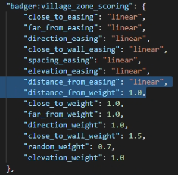

### Weathering 
This component contains all the terrain weathering settings. This component can be given to any of the village archetypes.

Component Name

badger:village_weathering 

Settings

**is_overhanging_edge**

Determines if the weathering effect will taper up or down.

**position_noise_scale**

Lower values will apply smoother xz jitter to weathering effects.

**wave_max_depth**

The maximum distance in blocks, before noise, that the weathering wave can remove blocks from an edge.

**wave_min_depth**

The minimum distance in blocks, before noise, that the weathering wave can remove blocks from an edge.

**wave_frequency_scale**

A smaller scale factor will reduce the frequency of the weathering wave for a smoother effect.

**wave_noise_scale**

The magnitude of noise used to break up the wave function.

**gradient_passes** settings:

The system supports multiple gradient passes, which determine how many blocks to remove and what height.

**gradient_depths**

A list of how many blocks deep into the terrain should be removed. These are expected to be in descending order. Each of these values corresponds to a value in the `gradient_weight_heights` list.

**gradient_weight_heights**

A list of heights for each gradient depth to be applied. These values should be in descending order for non-overhanging edges, and ascending order for overhanging edges. 1.0 means the top of the edge and 0.0 means the bottom. In the example, at a height of 0.8 and above, the terrain should be removed at a depth of 3.0. At a height of 0.6 and above, the terrain should be removed at a depth of 2.5.

**gradient_2d_noise_scale**

The magnitude of vertical noise applied to the gradient pass.  Lower value noise will look more continuous.  Higher will look more random.

**gradient_3d_noise_scale**

The magnitude of horizontal noise applied to the gradient pass.

**gradient_affected_by_wave**

Sets whether or not the particular gradient pass should be affected by the sawtooth wave. If they are affected, the gradient is applied only in spots where the sawtooth wave would remove blocks. If they are not, the gradient is applied consistently over the whole edge. Using a combination allows for some interesting weathering effects.

Example

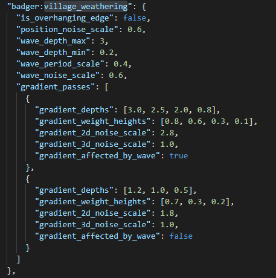

### Path (Building and District) 
These components contain all the village path settings.

Component Name(s)

**badger:village_building_path** and **badger:village_district_path**

Settings

**path_blocks**

A list of block names and their relative weights to be placed for the central portion of the path. Changing the weight influences which block is randomly selected.

**edge_block**

A list of block names and their relative weights to be placed along the outer edges of the path.

**edge_decoration_blocks**

A list of block names and their relative weights to be placed on top of the path edge blocks.

**inner_blocks**

path_blocks, edge_blocks, and edge_decoration_blocks can all be divided into inner and outer sections, as shown in the example for edge_decoration_blocks. This allows the inner and outer portions of the path and path edge to have different blocks with different weights. inner_blocks is a list of block names and their relative weights for the inner portion of the path or path edge.

**outer_blocks**

A list of block names and their relative weights for the outer portion of the path or path edge

**path_width**

The number of meters across the main portion of the path should be.

**edge_width**
The number of meters across the edge on either side of the main path should be.

**path_noise_scale_factor**
A small scale factor will produce more gradual changes in a building path's weathering.

**path_deco_noise_scale_factor**

A smaller scale factor will cause path edge decorations to alternate less frequently.

**path_block_noise_scale_factor**

A smaller scale factor will cause path blocks to alternate less frequently.

**path_edge_block_noise_scale_factor**

A smaller scale factor will cause path edge blocks to alternate less frequently.

**path_noise_amplitude**
The noise amplitude affects the severity of a building path’s weathering.  This affects both the edge and main path, but is capped by the path width + edge width + edge noise amplitude.

**edge_noise_amplitude**

How far noise can extend past the building path’s edge in meters.  

**diagonal_path_degree_tolerance**

The number of degrees a building path can deviate from right angles before being considered diagonal.

**prevent_buildable_placement**

Setting this to false will allow buildables to place so that they overlap paths.

**can_place_under_buildables**

Setting this to false will force paths to generate around buildables instead of underneath them.

**can_resuse_existing_paths**

Setting this to true will encourage paths to reuse existing paths and bridges. If a path step is reused, it won’t add any additional cost to the path being planned. If this is false, it’s possible for a path to overlap another, but the cost of the path will still be added to the path being planned as normal. If this is false, paths won’t be able to reuse existing bridges.

**height_change_needs_bridge**

If the height change between zones is equal to or larger than this value, a bridge must be placed to connect the two zones.

**outer_edge_threshold**

Sets the proportion of the inner and outer path. A lower setting means a larger outer edge and a higher setting means a larger inner edge.

Example

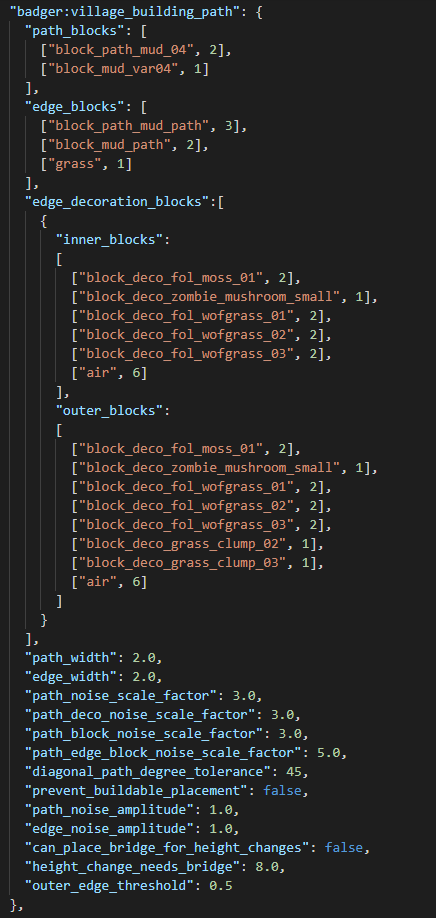

## Village Service Parsed Data 
The village service parsed data contains global settings that often affect all villages.

File Location

gamelayer/server/village/villages.json

Map Settings

**terrain_sampling_fill_step_distance**

When we sample the terrain data before planning the village, I don’t think we can sample the entire area at once (it used to cause a crash at least) so we do it in pieces that have a width and height equal to this step distance.

**block_query_step_distance**

This distance defines the resolution that we query the terrain for water and then markup zones with water inside them. Water detection should become more precise if this is a smaller value, but it’s also more expensive.

Building Settings

**approximate_block_budget_per_tick**

[not used]

**build_from_path_max_range_in_blocks**

When the build_from_district_path placement preference is used, zones won’t be considered if their distance to the starting path zone exceeds this max distance.

Navigation Map Settings

The village navigation system hasn’t been used in a long time.

**crossable_edge_minimum_length**

[not used]

**path_padding_width**

[not used]

**path_destination_arrival_distance**

[not used]

Influence Map Settings

**planning_influence_map_settings**

These settings affect the close_to_buildable, far_from_buildable, close_to_water, far_from_water, facing_buildable, and facing_water placement preferences.

**alliance_influence_map_settings**

These settings affect the close_to_influence, far_from_influence, facing_influence, and in_direction_of_influence placement preferences.

**decay**

How much influence is lost as it spreads.

**resolution**

The dimensions of the grid that influence will spread through.

**initial_influence**

The initial amount of influence before it decays.

Placement Preference Settings

**buildable_tag_for_spacing**

By default, every buildable request will be given a far_from_buildable** **placement preference with this tag to help ensure buildables space themselves out; However, if the buildable request has the disable_spacing placement preference, this tag won’t be used.

Heart Destruction Settings

**world_request_type**

When a village has been destroyed (e.g. portal destroyed), this world request type is used to load the world. It will determine the priority of the world request.

**tag_for_village_heart_destruction_opt_out**

[not used]

Wall Settings

**max_number_of_gate_placement_attempts**

If a gate collides with another structure (usually a bridge/staircase) we’ll move the gate position 1 meter in the direction of the path entering the wall and then the gate will try to place again. This is the max number of attempts before the gate will fail to place.

**minimum_segment_length**

When a structure is being embedded in a wall, we’ll extend the wall if the original wall isn’t long enough. We’ll skip walls that are less than this length when we’re creating the extended wall.

**remove_wall_on_placement_failure**

Specifies if a gap in the village walls should be left when we fail to embed a structure in the walls.

Moat Settings

**noise_levels**

This controls how many levels of detail the moat noise is going to have. At each level, the frequency of noise is doubled and the amplitude is halved. This setting will affect all villages that have the new badger:village_moat component. It’s probably not worth having too many levels because the finer details are going to be lost when converting to block space. Also something to note is that because the end result is normalized to a value between 0 and 1, more levels of noise will have kind of a smoothing effect, mellowing out some of the interesting outliers when all the levels are averaged.

### Performance Settings

#### building_time_budget_in_ms
The village building system will handle pending placements until this budget is reached or passed.

**planning_time_budget_in_ms**

The village planning system will handle village generation requests until this budget is reached or passed.

## Entity Removal Service Parsed Data 
Specifies what entities should be removed inside the village bounding area and inside the world reload areas.

File Location

data\behavior_packs\badger\services\entity_removal.json

Settings

**include_any**

Entities with these tags should be removed.

**exclude_any**

Entities with these tags won’t be removed.

Examples

Before (floating chests)

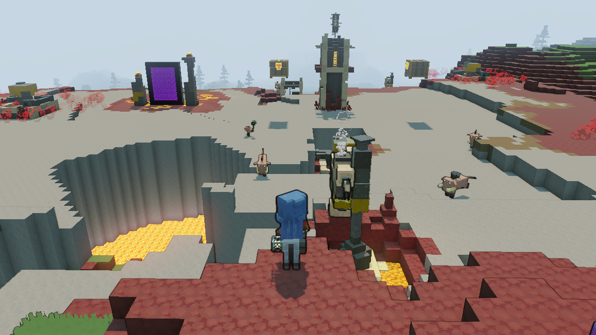

After (no floating chests)

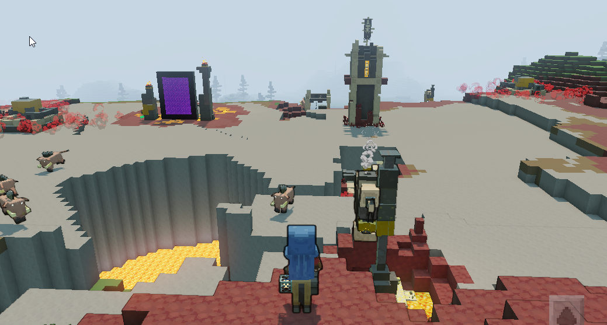
