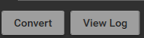
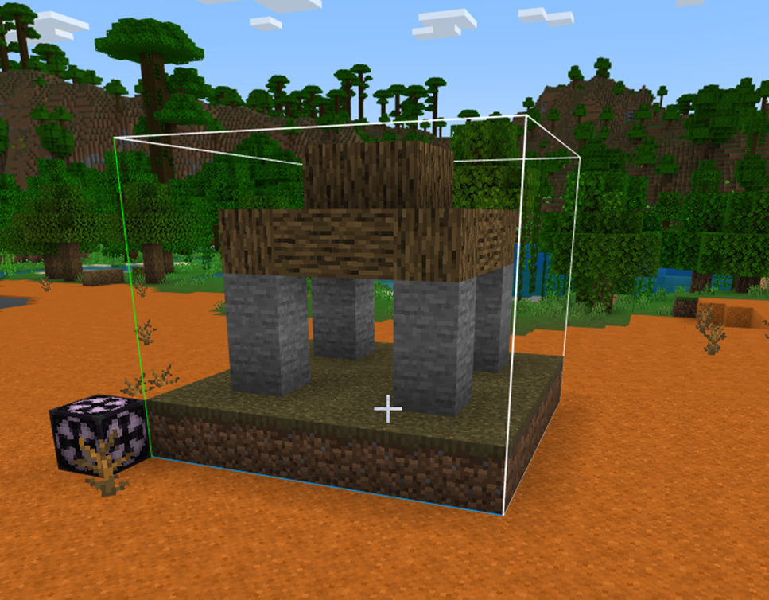
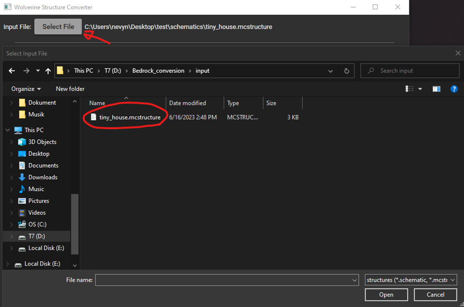

# Wolverine: Structure Converter
Structure files allow creators to save pre-constructed sections of blocks for reuse.  Building larger structures inside of Minecraft Legends is as convenient as Minecraft: Bedrock and Minecraft: Java, with their mature creative workflows. To improve the structure creation process, the Wolverine tool was created.  

Wolverine allows creators to convert Minecraft: Bedrock (.mcstructure) files, Minecraft: Java (.nbt) structure files, and community (.schematic) files to the Minecraft Legends (.mcstructure) structure format. This enables creators to use familiar tools to create new content, as well as importing previously created content into Minecraft Legends.

To use this tool effectively, we recommend being familiar with data blocks as a concept and the specific properties contained within the data blocks in both Minecraft and Minecraft Legends.

In this article covers the following topics:

* How to install Wolverine

* Wolverine overview

* Wolverine interface and process overview

* Structure conversion example

* Using Wolverine from the command prompt


```
Important! 
This tool currently supports .mcstructure, .nbt, and .schematic file types, but not .schem files. 
When designating a source file to convert, please make sure to confirm you're using a support file type!
```

# Running Wolverine
To install and run Wolverine please do the following:
1.	Download the tool from the following link: [Insert Link here]
2.	Then extract the tool to the desired location. 
3.	Run the WolverineUI.exe in the extracted folder or from a command prompt. For more information on command prompt usage see the “Command Prompt” section below.)


# Overview

Wolverine takes a Minecraft: Bedrock .mcstructure file, a Minecraft: Java .nbt structure file, or a community .schematic (but not .schem) file as input.  It identifies the individual Minecraft blocks used to create the structure and then it converts them to the desired Minecraft Legends blocks (either custom ones in a data pack or basic ones from base game) and outputs a Minecraft Legends .mcstructure file that you can use to add your content to the game.

### Input File
Before you can use Wolverine, you must first create an input file.  For more information on how to create a Bedrock structure file read the following article: [Introduction to structure blocks](https://learn.microsoft.com/en-us/minecraft/creator/documents/introductiontostructureblocks).  Exporting .nbt structure files from structure blocks in Minecraft: Java is similar. There is no official documentation on how to export .schematic files from Minecraft: Java, but there are multiple guides available by searching for “how to export a Minecraft java schematic” in the search engine of your choice.

# Interface

The easiest way to interact with Wolverine is through the UI.  The Wolverine UI has 4 sections.  The following is an overview of the interface and what each section of the UI does:

### Input Section
This section is where you select your input .mcstructure, .nbt, or .schematic file. Select the [Select File] button, navigate to an appropriate input file, and then select it.


### Resource Pack Section
This section is where you define the library of Minecraft Legend blocks that you are able convert to. By default, you have access to all the Minecraft Legends blocks in the “Known Blocks” area.


This is a large list. To make it easier to look for specific blocks, you can type a keyword into the input field and select the `Filter Knowns` button to only view blocks that contain the specified keyword.

If you have created custom Minecraft Legends blocks you can add them by selecting the `Add Resource Packs` button, navigating to the appropriate resource pack, and then selecting it.  Resource Packs define custom blocks in a blocks folder.


This adds the custom blocks to the list of valid block conversion targets.

# Block Conversion Section
This section is where you define the block conversions. The two columns on the left side of the arrow define which block in the input structure to target for conversion. The two columns on the right of the arrow define which block to place in the output structure in place of the input block.


### Adding Block conversions:

* To add blocks to the conversion, press the green `+` button at the top left of the section. This creates a new row with empty input fields where you can define the input and output blocks and the specific properties.

* To copy an existing block conversion, press the green `+` button at the left end of that row to create a new row with the same values.

* To add all the unknown blocks within the input structure to the list, press the `Add Unknown Blocks` button at the top of the section.

### Removing Block conversions:

* To remove a row, press the red `x` at the right end of the row.

* To clear all conversions, press the `Clear Replacements` button at the top of the section.

### Saving/loading conversion lists:

* To save a list of conversions, press the `Export Replacements` button at the top of the section.

* To load a list of conversions, press the `Load Replacements` button at the top of the section.

### Setting up for conversion:
There are a small number of blocks supported in both Minecraft and Minecraft Legends: water, stone, grass, bedrock, dirt, and air.  These blocks will be automatically converted.  All other blocks, if left without a block replacement, will become air.  To find out which blocks in the input structure will be converted to air, press the `Add Unknown Inputs` button, and new block replacement rows will be added for each block. 

To help create your block replacements, you can use the “Known Blocks” from the Resource Pack section.  Selecting one of these blocks will set the destination block name of the selected row of the block replacement list.


For more specific input block selection, specify a block property, as a key:value pair in the block property field.  This block property acts as a filter on the input block – only blocks that match the block property will follow the current block replacement rule.  Only a single property is supported.  Examples include stone_type:cobblestone and pillar_axis:x.  The output block can also have a single block property specified, which adds that property to the output block.

# Convert Section
Press the `Convert` button to initiate conversion using the listed replacement pairs and resource packs given.  The conversion process will take several seconds depending upon the size of the input file, then display a dialog when done.  The log shows the most recent conversion’s output messages, recording the successful structure file generation or providing any warnings or errors from the conversion.  If any blocks were missed, the user will be prompted with the option to add those unknown blocks to the replacement list for subsequent conversions.



# Minecraft: Bedrock to Minecraft Legends workflow example

In this section we’ll look at an example conversion. 

### Bedrock Export
The example structure was constructed in Minecraft: Bedrock using the information from [Introduction to structure blocks](https://learn.microsoft.com/en-us/minecraft/creator/documents/introductiontostructureblocks).  The structure was made from 3 different blocks: minecraft:wood, minecraft:stone, minecraft:grass and then exported to a file called tiny_house.mcstructure.




Open the Wolverine UI application and then press the `Select File` button and navigate to the location of the exported .mcstructure. 



The following sections demonstrate a “Simple Conversion” and a “Custom Conversion”.

## Simple Conversion
Wolverine includes some automatic conversions such as minecraft:grass and minecraft:stone that automatically gets converted to badger blocks. Since two of the blocks in our example fall into this category, all that is required for a simple conversion is to add a replacement rule for minecraft:wood. Let’s convert to a block that is as close to the original as possible:

 grass     ->	grass

 stone     -> 	stone

 wood 		->	badger:plank_dark_oak_fine.

 to get the desired result do the following steps:

1.	Select the `Add Unknown Blocks` button. This will add the minecraft:wood block to the conversion


2.	Select inside of the “Output Block Name” field in the block section. Then In the filter window type oak and select the “badger:block_planks_dark_oak_fine” block to add it to the name field enabling the conversion of wood -> dark oak planks fine.


3.	Press the `Convert` button and choose a location. If you select the structures folder of your Myth’s Behavior Pack, Minecraft Legends will be able to import it when that Behavior Pack is active.

## Custom Conversion
To change automatic conversions, you must know the source blocks identifier and add them manually. In this instance I want to change the conversion to become closer to a Greek temple rather than a simple stone and wood construction. to get the desired results do the following:

1.	Press the `Add Unknown Blocks` button. This will add the minecraft:wood block to the conversion.


2.	Then add your additional blocks by pressing the `+` until you have the number of blocks that the structure contains (in this case 2 more blocks) and add then in my case do the following conversions:

 	minecraft:grass   ->   badger:block_alabaster

  	minecraft:stone   ->   badger:block_alabaster_stone_column

  	minecraft:wood    ->   badger:block_alabaster_carved


3.	Press the `Convert` button and choose a location to save your output structure. 

# Using Properties in Conversions
Notice that the wood blocks in the input file had various orientations but were converted to uniform blocks in the output.  Conversions can be more precise by specifying block properties.  In the following example, the pillar_axis property is specified in the input block property, so that the input blocks are converted based on orientation. 


# Command prompt
The Wolverine conversion tool is packaged with two executables you can use to convert structures:

* WolverineUI.exe: The user interface described above.

* StructureConverter.exe: The command-line interface.

StructureConverter.exe is intended for incorporation into a batch conversion process, allowing you to automate the conversion of many structures.  The options JSON parameter contains fields that correspond to the Wolverine elements described above.

If you run StructureConverter.exe without any arguments, you will be given some info on the available options and how to format the command. The following is an example of converting one schematic file named hss_hubstructureCarpet.schematic and replacing some of its blocks with blocks from Minecraft Legends:

```
StructureConverter.exe "hss_hubstructureCarpet.schematic" "{ 
    ""output"":""badger"",
    ""replace"" : [
        { 
            ""to_replace"" : {
                ""block"" : ""minecraft:planks""
            },
            ""replace_with"" : {
                ""block"" : ""badger:block_planks_dark_oak""
            }
        },
        {
            ""to_replace"" : {
                ""block"" : ""minecraft:stone""
            },
            ""replace_with"" : {
                ""block"" : ""badger:block_planks_dark_oak_fine""
            }
        },
        {
            ""to_replace"" : {
                ""block"" : ""minecraft:log""
            },
            ""replace_with"" : {
                ""block"" : ""badger:block_log_dark_oak""
            }
        }
    ],
    ""badger"": {
        ""unknown_blocks"": [
            ""print"", 
            { 
                ""replace_with"" : { 
                    ""block"" : ""minecraft:air"" 
                }
            }
        ],
        ""resource_packs"": [
            ""D:\\resource_packs\\MyCustomBlocks""
        ]
    }    
}" output.mcstructure
```
