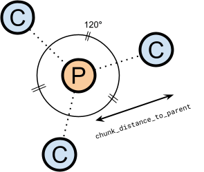
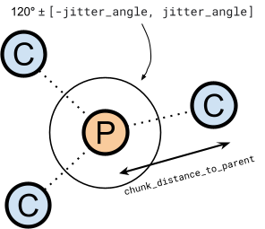
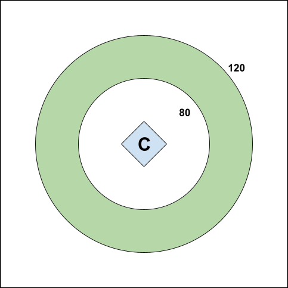
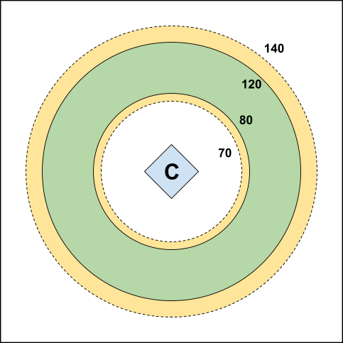
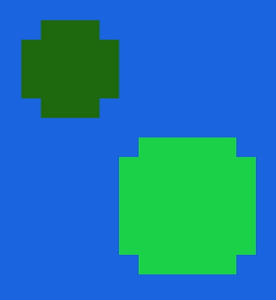
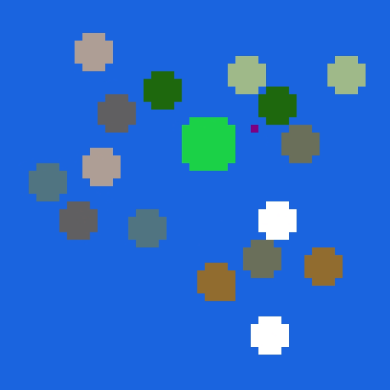
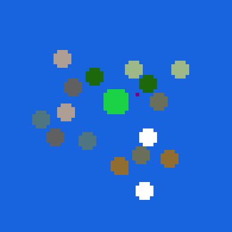
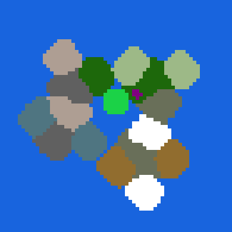
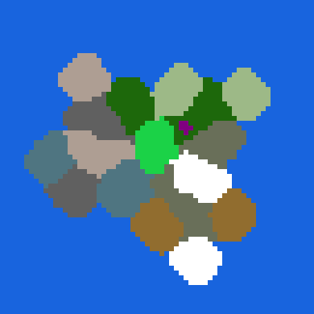

# Minecraft Legends World Placements


**Figure 1:** A typical world generation process.

## What are world placements?
World placements are things that we want to appear in the world – biomes, POIs, bases, villages, etc. Each one has certain rules that determine where they should be placed on the map, and these rules can reference other specific placements or classes of placements. These placements are the fundamental drivers of Minecraft Legends' world generation system, and they completely define the layout of each world.

World placement data lives in `behavior_packs/x/gamelayer/world_placements/`, where `x` generally refers to a game mode, and the data may be broken up into different files to improve readability. For example, our campaign data is currently split into ten files.


## How do they work?
### Low-resolution biome grid
During this phase of world generation, our world map is represented by a grid whose cells are 8✕8 chunks in area (128✕128 blocks). Each pixel in fig. 1 is one of these cells. From now on, we will refer to these cells as **_pixels_**.

Some placements “bring” biome pixels along with them. For example, this placement will reserve 9 pixels of `frostlands` biome at the start, and eventually attempts to spread out to 40 pixels.

```
"biome": {
  "biome": "frostlands",
  "total_pixels": 40,
  "starting_pixels": 9,
  "spread_priority": 0
},
```

Many placements do _not _bring biome pixels with them, but any placement that uses `distance` rules is allowed to try!

### Types of placements
We can introduce an arbitrary number of placement types with the `placement_type` attribute. Placements are grouped together with other placements that share their placement type. In the placement rules, we can query the distance to some non-particular element of any of these sets, which is useful for ensuring that we never place too close or too far away from something. For example, in the campaign mode, we have a `"village"` `placement_type` group, and we can use that to write a rule that requests that a placement is placed within [x, y] chunks of a village. (We _could_ choose a particular village, but in this case, we just want it to be near _some_ village.)

```
{
  "distance": {
    "chunk_distance_from_parent": 25,
    "distance_to_zero_score": 10,
    "tag_parent": "village",
    "weight": 3
  }
}
```

### Placement rules
The positioning of each placement is determined by its placement rules.

#### Types of placement rules
##### game_start
This rule is currently exclusively used to establish a “`center`” placement that subsequent placements may place relative to. It automatically assigns the placement with this rule to the (0, 0) position (the center of the world grid). If this rule is assigned to a placement, it is a good idea to ensure it is placed first (via `world_definition.js`, which is outside the scope of this document). It is also not able to be combined with any other placement rules (since it automatically determines the placement position).

```
{
  // [placement details here]
  "placement_rules": [
    {
      "game_start": {}
    }
  ]
},
```

##### distance
This rule does most of the heavy lifting. Most placements employ one or more `distance` rules. An example from the campaign “`extreme_hills_1`” biome placement is shown below.

```
"placement_rules": [
  {
    "distance": {
      "chunk_distance_from_parent": [
        64,
        96
      ],
      "distance_to_zero_score": 20,
      "tag_parent": "center",
      "weight": 3
    }
  },
  {
    "distance": {
      "chunk_distance_from_parent": [
        40,
        105
      ],
      "distance_to_zero_score": 10,
      "tag_parent": "wellOfFate",
      "weight": 1
    }
  },
  {
    "distance": {
      "chunk_distance_from_parent": 40,
      "distance_to_zero_score": 20,
      "tag_parent": "village",
      "weight": 1,
      "mandatory_threshold": 0.5
    }
  }, // etc.
]
```

Each rule has a `weight`, a `tag_parent`, and a `chunk_distance_from_parent`. Essentially, “I want to be `[chunk_distance_from_parent]` chunks from `[tag_parent]` placement (or placement type), and this desire is `[weight]` important”. 

Each individual distance rule is scored for each available placement candidate, and then the candidate receives a total score based on the individual scores’ weighted average. The position with the highest overall score wins. In the event that multiple position options share the same high score, one is chosen at random. See Scoring distance rules for more details, as well as a detailed explanation of `mandatory_threshold` and `distance_to_zero_score`.

Within the winning grid position, the precise placement location is offset by a random amount, controlled by a placement’s optional `jitter` parameter.

###### chunk_distance_from_parent
This is how far we want our placement to place away from the parent placement or placement category, in chunks (16-block units). We can either provide two integers, interpreted as a minimum and maximum; or one integer, interpreted as a minimum with ∞ as the maximum. Note that providing two identical integers will cause the range to be interpreted as the latter case, with ∞ max distance – the exception to this rule is `[0, 0]`.

###### one_of
Distance scores can also nest recursively into themselves using the `one_of[]` attribute. `one_of` rules are scored by assessing all the constituent rules and yielding the maximum among them. They are particularly useful in scenarios where you want something to place near one of several specific placements, and it doesn’t matter which one. In the following example, a placement has two `distance` rules, the second of which is itself made up of two more `distance` rules. The placement will attempt to place within 24 chunks of either `brokenlands_1` or `brokenlands_2.`

```
"placement_rules": [
  {
    "distance": {
      "chunk_distance_from_parent": 25,
      "distance_to_zero_score": 10,
      "tag_parent": "village",
      "weight": 3
    }
  },
  {
    "distance": {
      "one_of": [
        {
          "chunk_distance_from_parent": [
            0,
            24
          ],
          "distance_to_zero_score": 30,
          "tag_parent": "brokenlands_1"
        },
        {
          "chunk_distance_from_parent": [
            0,
            24
          ],
          "distance_to_zero_score": 30,
          "tag_parent": "brokenlands_2"
        } // etc.
      ]
    }
  }
]
```

##### precise_distance
Sometimes, we need something to reliably place relative to another placement with a higher level of precision than what is possible with the normal `distance` rule (8✕8 chunks). In this case, we can use a precise distance rule. A placement may only have one precise distance rule, and precise distance rules cannot be used in conjunction with any other types of placement rules. **Note that biome pixels cannot be placed with <code>precise_distance</code> rules.</strong>

```
"placement_rules": [
  {
    "precise_distance": {
      "chunk_distance_from_parent": [
        8,
        9
      ],
      "tag_parent": "wetlands_1_village",
      "jitter_angle": 1,
      "do_not_scale_distance": true
    }
  }
]
```

Each rule has a `tag_parent`, a `chunk_distance_from_parent`, and may optionally have a `jitter_angle` attribute. The placement will place exactly within the range of `chunk_distance_from_parent` distance away from the placement specified by `tag_parent`. **Note that unlike in the regular distance rule, the <code>tag_parent</code> in the <code>precise_distance</code> rule <em>must</em> be a specific placement, not a <code>placement_type</code>. </strong>

If the placement specifies multiple `initial_villages`, they will all be spread around the parent placement, with random radii (as above, within the range given by `chunk_distance_from_parent`) and perfectly even angular spacing from one another (fig. 2). If the precise distance rule specifies a `jitter_angle`, the angular spacing of each placement is randomized within +/- `jitter_angle` radians (fig. 3).


<table>
  <tr>
   <td>
   </td>
   <td>
   </td>
  </tr>
  <tr>
   <td><b>Figure 2:</b> A precise distance placement with three <code>initial_villages</code> and <code>jitter_angle == 0</code>. Each placement (<strong>C</strong>) has equal angular spacing (120<strong>°</strong>, in this case) and respects the desired distance to their parent (<strong>P</strong>).
   </td>
   <td><b>Figure 3:</b> A precise distance placement with three <code>initial_villages</code> and <code>jitter_angle != 0</code>. The placements (<strong>C</strong>) still respect the distance to their parent (<strong>P</strong>), but the angles are somewhat randomized (exaggerated slightly for effect).
   </td>
  </tr>
</table>

##### saturate
The saturate rule is used to place many copies of a placement all over the world. This rule has just one optional parameter: `density_per_8x8_chunk_pixel`. This many copies of the placement in question are placed within each non-ocean pixel in the biome grid (with jitter, again, subject to the placement’s optional jitter parameter). Currently, the saturate rule is used to place `slot_invasion` throughout the world, which can be used to dynamically place piglin bases during gameplay via the invasion system.

The saturate placement rule is intended to be used with a particular slot-type placement. Only one placement may use the saturate rule. (If multiple placements use the saturate rule, only the one parsed last will actually be placed.) The saturate rule also may not be used in conjunction with any other placement rules. 

##### explicit
The explicit rule is used to place a particular placement at an exact position in the world (`block_x`, `block_z`). It is not currently used by any campaign placement, but it may be useful for debugging purposes. The explicit rule may not be combined with any other rules.

#### Scoring distance rules
When we are placing something that uses distance rules, we test every possible location (that is, each available pixel in the biome grid) and pick the one that nets us the best weighted score. 

##### Single rules
We will illustrate the following example:

```
"distance": {
  "chunk_distance_from_parent": [
    80,
    120
  ],
  "distance_to_zero_score": [
    10,
    20
  ],
  "tag_parent": "center"
}
```

Here, we are asking to place something between 80 and 120 chunks from the center placement (which is located in the center of the biome grid). See fig. 4.



**Figure 4:** Visualizing the aforementioned placement rule, with a range of [80, 120] to the center placement (<strong>C</strong>). Any pixels in the green section are awarded a score of 1.0, and pixels outside of this section receive a score of 0.0.

##### distance_to_zero_score
The above example employs the optional `distance_to_zero_score` parameter. This allows us to award non-zero scores to placements that are outside of the `chunk_distance_from_parent` range by up to `distance_to_zero_score` chunks. There is a linear falloff behavior where pixels closer to the `chunk_distance_from_parent` range receive scores closer to 1.0, and the scores approach 0.0 as the distance from the core range approaches `distance_to_zero_range` (fig. 5). 

If `distance_to_zero_score` is provided as an array of two integers, the first is interpreted as the “inner” distance value and the second is the “outer” – this is helpful for situations where we can be more lenient in either the “too close” or the “too far” direction. Conversely, if only one integer is provided, it is interpreted as both the inner and outer distance.



**Figure 5:** Visualizing the aforementioned placement rule but with the addition of a <code>distance_to_zero_range</code> of 20. Any pixels in the green section are awarded a score of 1.0, pixels in the yellow section receive a score between 0.0 and 1.0 (closer to green means higher score), and pixels in white sections receive a score of 0.0.

##### mandatory_threshold
If a placement rule scores below its given mandatory threshold for a given candidate location, the total weighted score will be zero for that candidate location. Thus, `manditory_threshold` is useful for situations where you want to ensure one or more particular rules are respected. A low threshold (e.g. 0.1) means we have more leniency in the `distance_to_zero_score` sense, while a high threshold (e.g. 1.0) means we have no leniency.

Be cautious when assigning `manditory_threshold` to multiple distance rules on one placement, because that may significantly decrease the probability of finding a successful candidate location.

##### Rule weights
Each distance rule has a `weight` attribute indicating its relative importance. That is, if a particular distance rule is very important compared to another one, it is a good idea to assign a large weight to the more important one and a small weight to the less important one.

We calculate a total weight w<sub>t</sub> by summing the individual weights w<sub>i</sub>:


The final score s<sub>f</sub> for a potential placement location is given by the sum of each individual score s<sub>i</sub> multiplied by its weight w<sub>i</sub>, all divided by the total weight w<sub>t</sub>:


For example, if for a given potential placement location:

* rule 1 receives a score of 0.9 and has a weight of 2
* rule 2 receives a score of 0.4 and has a weight of 5

Its final score will be:


### Placement order
Since many placements explicitly reference other placements via distance rules, it is important that the order of placement is logically consistent. The order is determined by `world_definition.js`, which is outside the scope of this document. Typically, the order goes something like:

1. `center` places in the center of the map, every time;
2. Well of Fate places some radius away from the center;
3. Every other biome places;
4. Villages/POIs/bases in whatever order you like

## Placement options
We can do all of the following (note that we can combine these options quite freely):

### Place villages/bases/slots
One of the common use cases for placements is placing villages, bases, or slots. There is a lot that happens behind the scenes on the B# side, and I’m not going to get into too much detail on that.

```
{
  "unique_card_id": "badger_first_village_culture_required",
  "map_data": "badger:villager_culture_001",
  "village_data": "badger:villager_village_001",
  "placement_name": "forest_1_village",
  "placement_type": "village",
  "add_to_poi_graph": true,
  "allow_rivers_nearby": false,
  "initial_villages": {
    "small": {
      "count": 1
    }
  }, // placement rules follow...
  ```

#### map_data and village_data
This is referenced by B# for the campaign.

#### placement_name
The name that this system will use internally to reference the location that is chosen for this placement. See `distance` rule.

#### placement_type
See Types of placements. This must be one of the types listed there.

#### initial_villages
This is where we define how many of this placement to place, and what this placement’s invasion value should be.

##### [size]
We can specify any number of “sizes”, each one with its own `count` and `invasion` settings. `[size]` can be any `string`. B# can query these size names internally.

###### count
The number of copies of this placement we should place in the world.

###### invasion
This is referenced by B# for the campaign.

### Place textures
A placement may place a texture in the world.

```
"textures": [
  {
    "enabled": true,
    "texture_key": "primary_texture",
    "texture_name": "utopia_biome_village_stamp",
    "manual_height": true,
    "manual_height_range": [
      20,
      26
    ]
  }
],
```

#### textures
Here we list as many textures as we may want to use. Textures can be swapped dynamically during gameplay.

### Place biome pixels
Any placement can ask to reserve a certain number of biome pixels, both up-front and after biome expansion. 

```
"biome": {
  "biome": "generic",
  "total_pixels": 20,
  "starting_pixels": 1,
  "spread_priority": 0
},
```

#### biome (string)
The name of a biome to place. Note that one option here is “`generic`”, which means that undifferentiated land pixels will be placed to ensure that there is land associated with the placement, and the undifferentiated pixels will be replaced with a sensible specific biome in a later step. See Generic biome fill.

#### starting_pixels (int)
The number of pixels this placement should initially reserve. Note that this number will usually not be _exactly_ the number of starting pixels, because we convert this number to a circle whose area matches the number as closely as possible. For example, in fig. 5, we see the results of the Well of Fate (light green) and forest 1 (dark green) placements after reserving their starting pixels. Forest 1 requests 25 starting pixels, but the nearest-sized “circle” we can achieve is 21.

#### total_pixels (int)
The number of pixels this placement should eventually grow to. See Biome expansion.



Figure 5: Two placements reserving biome pixels before the expansion phase.

#### spread_priority (int)
This placement’s biome pixel spread priority. 0 priority gets to spread out first, followed by 1, 2, etc. 

### Spawn entities
B# can spawn entities through world placements. We currently use this system to spawn the “world center locator” entity.

```
"spawn_entity": "badger:world_center_locator"
```

#### spawn_entity (string)
The name of an entity to spawn at the location where this placement is placed. This should match the name of an identifier in the entities folder (`behavior_packs/badger/entities/`).

### Miscellaneous
#### jitter (float in range [0.0, 1.0])
Determines the amount of random variance the placement’s position may have within its 8✕8 chunk pixel. 0.0 means that the placement will always be placed exactly in the middle of the pixel, while 1.0 means the placement can appear anywhere within the pixel.

#### add_to_poi_graph (bool)
Determines whether the placement factors into the POI mesh, a system that we can use to place world features along imaginary lines between nearby world placements.

#### allow_rivers_nearby (bool)
Determines whether the placement should have rivers nearby.

## Everything’s placed – what’s next?
### Biome expansion
Once we run the placement algorithm and resolve all the placement locations, we have something that looks like this:



Each placement with a non-zero `starting_pixel` count has reserved those pixels on the biome grid. Now we begin expanding each of these placements until they either

1. Reach their desired `total_pixels` size; or
2. Become boxed in by other biomes and have nowhere left to expand to.

This expansion process happens in rounds, with each placement claiming one pixel per round.



### Island detection
Now we check to see if there are any islands (land biome pixels that are completely surrounded by ocean). If there are, we throw away the results of our world generation up to this point and start over with a different seed. This island detection step can be bypassed with a game rule (`"allowislands"`) if your game mode should allow islands.

### Interior ocean fill
Now we run an algorithm that detects any “interior ocean” (clusters of ocean pixels that are fully enclosed by land pixels) and another algorithm that fills those interior ocean pixels in with any neighboring biome type.



### Generic biome fill
Now we detect any generic biome pixels (shown here in purple) and replace them with neighboring land pixels. If there are no adjacent land pixels, world generation will fail and restart with a different seed.


